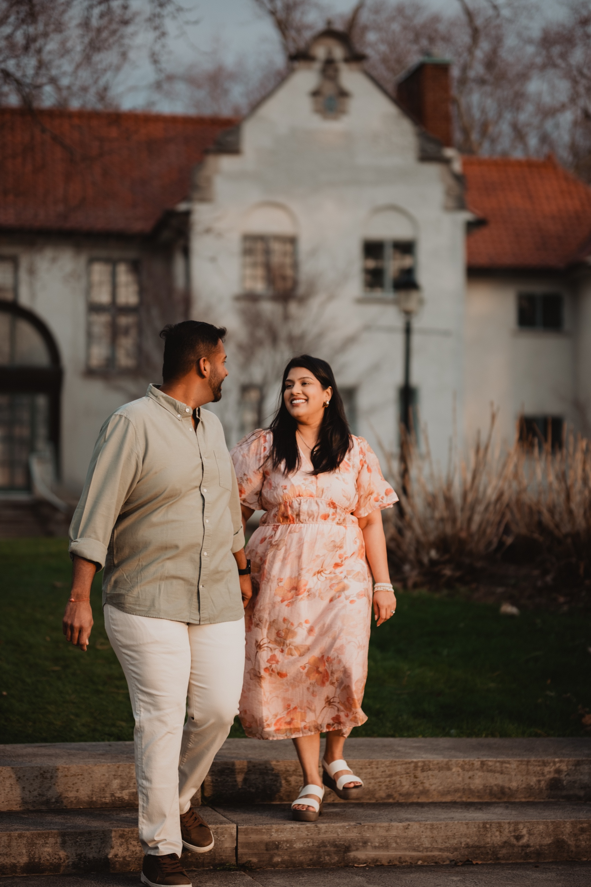
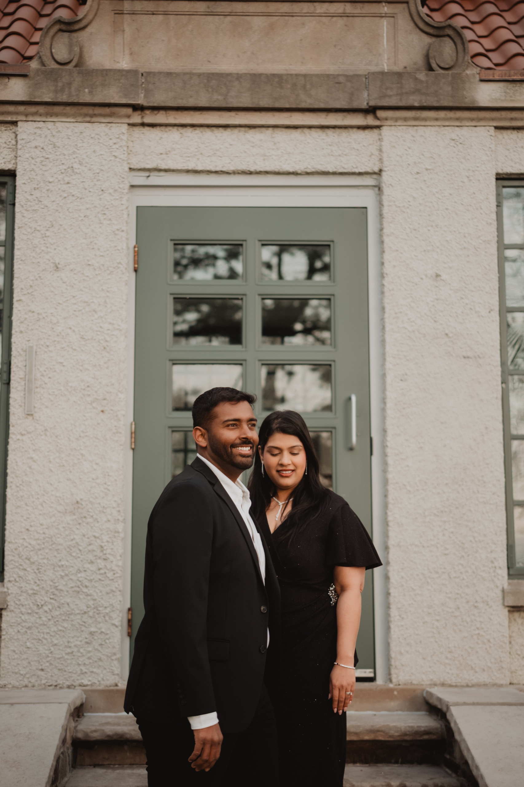
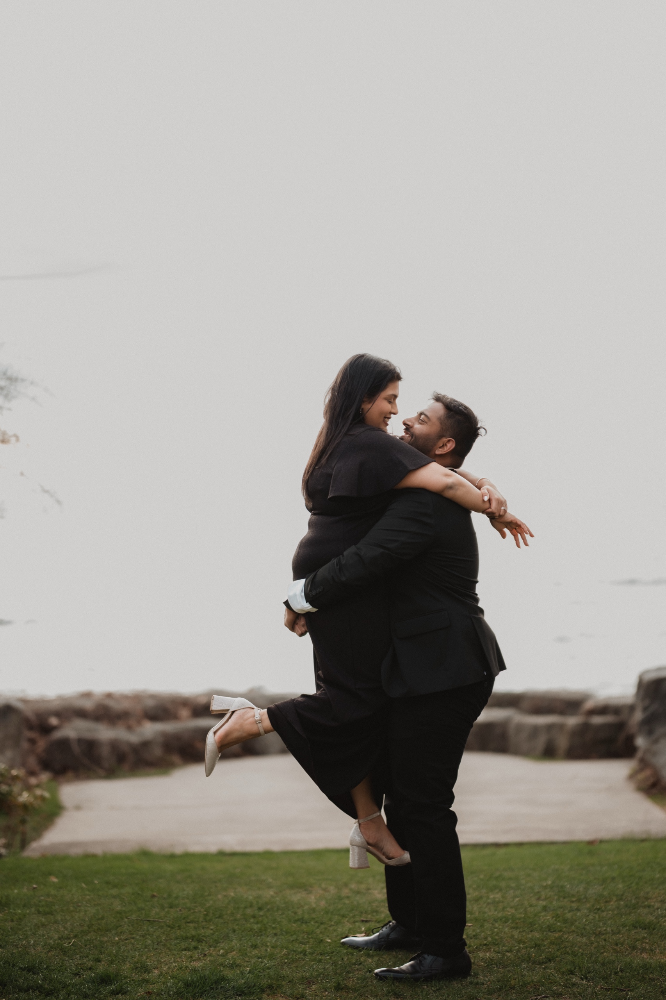
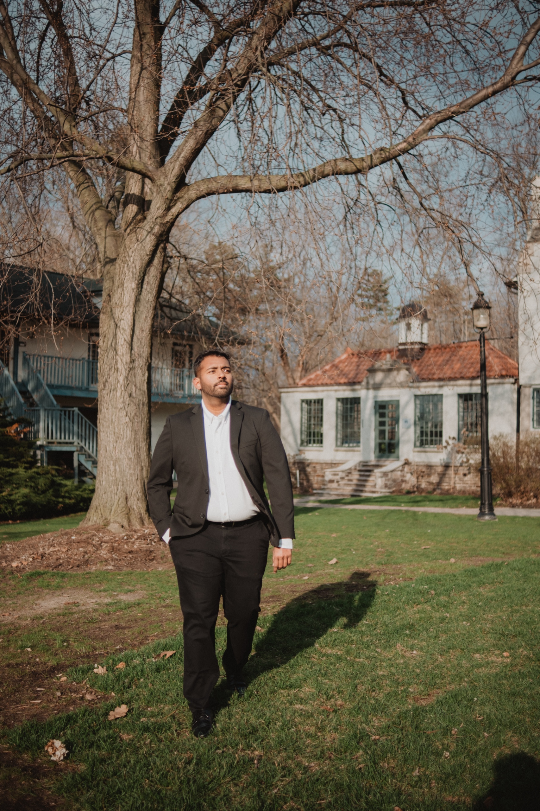

Adamson Estate sits on a quiet stretch of the Lake Ontario shoreline in Mississauga, ten minutes from the highway and somehow a hundred years away from it.

We photographed Ayushi and Parth's pre-wedding session here on a clear afternoon a few weeks ago. Stone, ivy, lake light, and almost no one else on the grounds for two full hours. It felt like we'd been let into someone's private country house and asked to take our time with it.

If you've been thinking about Adamson Estate for your wedding or engagement shoot, this is everything we wish someone had told us before we first photographed there. The light. The best corners. The permit you'll need. What to plan for. And what the room actually feels like, from a photographer who has worked the grounds.

## Adamson Estate at a glance

**Location:** 850 Enola Avenue, Lakeview, Mississauga. On the south side of Lakeshore Road East.

**Year built:** 1919. A Colonial Revival stone manor with Flemish accents, designed by the Toronto firm Sproatt and Rolph.

**Setting:** Lakefront heritage estate with formal gardens, a stone terrace, brick courtyards, and ivy-touched archways.

**Drive time:** About 30 minutes from downtown Toronto.

**Parking:** Free on-site lot adjacent to the estate. Spaces are limited, so arrive early on weekends.

**Walking level:** Low. Flat lakefront grounds with ramp access to the main house. The second floor is stairs only.

**Photo permit:** A City of Mississauga commercial photography permit is required for professional and wedding shoots. Personal shots are fine without one. Call the City at 905-615-4100 to confirm current fees.

**Best seasons:** Spring through fall. The grounds glow most in May, June, September, and October.

## What makes Adamson Estate feel cinematic

The first thing you notice is the silence. The estate sits behind a low stone wall on a quiet residential road, and once you're through the gate the city falls away. No traffic noise. No streetcars. Just the wind coming off the lake and the occasional gull.

The manor itself was built in 1919, designed by the Toronto firm Sproatt and Rolph in a Colonial Revival style with Flemish gables and roughcast stone. The proportions are restrained and warm, more country house than monument. South-facing terraces catch the late afternoon light off the water, and a row of tall windows on the lake side throws long shadows across the lawn around six in the evening from May to August.

What that means for your photographs: the architecture does a lot of the work. Every wall has texture. The ivy reads soft on camera. The brick courtyards have a hand-laid pattern that catches light differently from every angle. We rarely have to do much in this kind of space. Pose two people in front of a stone wall, wait for the wind to do something with her hair, and the frame builds itself.

The grounds are wide enough that you can spend three hours here without repeating a backdrop. The gardens, the manor facade, the lakefront, the back terrace, the wooded path along the east side. All of it within a four-minute walk. We've never left an Adamson session wishing for one more spot.

## A real pre-wedding shoot at Adamson Estate

We shot Ayushi and Parth's pre-wedding session at Adamson on a clear May afternoon. They drove in from the city around four, and we worked through the grounds backwards: starting at the lakefront for the soft early golden hour, then moving inland through the gardens as the sun got lower.

The light at Adamson during the last two hours before sunset does something most Toronto locations can't. It comes off the water, hits the stone of the manor, and bounces back warm. There's almost no harsh shadow, even mid-summer. Ayushi was in a cream lehenga that caught every bit of that bounced light. Parth wore a deep charcoal sherwani. They worked beautifully against the warm grey stone.

We spent the back half of the session in the brick courtyards behind the main house. The patterned brick walls, the ivy, and a single deep archway gave us three completely different backdrops within twenty feet of each other.

By the end of golden hour we were back on the lakefront. The wind picked up off Lake Ontario. The light went the soft amber that only happens between 7:45 and 8:15 in early summer. We let them stand still and let the lake do the rest.

The full gallery from their afternoon is on our portfolio: [Ayushi + Parth at Adamson Estate](/portfolio/ayushi-parth-adamson).

## The five best photo spots at Adamson Estate

After multiple sessions here, these are the five spots we come back to every time.

### 1. The lakefront terrace

The south-facing stone terrace runs the full length of the manor on the lake side. It's where the bounce light off the water is strongest, and the railing makes a clean leading line out toward Lake Ontario. Best between two hours before sunset and twenty minutes before. You'll get warm side light on faces and the lake going silver in the background.

### 2. The front facade and stone steps

The main entrance is what you'd photograph if you only had ten minutes here. Stone steps, an arched doorway, ivy curling up around it, the kind of symmetry that feels classical without being stiff. Best in the morning, or after the lake side has gone too warm in the late afternoon, when the front catches softer indirect light.

### 3. The brick courtyards

Behind the manor, two brick courtyards open onto each other. The patterned brick walls and ivy work as a near-infinite backdrop with subtle variations. We use this stretch for portraits where the couple is the only thing the eye can land on. Good in any light. Particularly nice on overcast days when the brick reads warm.

### 4. The wooded path along the east side

Walk fifty feet east of the main house and the property opens into a quiet wooded stretch. The trees filter the light into long parallel beams in late spring and fall. Great for backlit walking frames and the kind of intimate close-ups that need a softer backdrop than stone.

### 5. The back lawn looking toward the lake

Stand on the back lawn with the manor behind you and the lake at the far edge of the frame. This is the wide cinematic shot. Best at the last fifteen minutes of golden hour when the sky goes pale gold and the lake catches it. We always save one of these for the end of the session.

## When to shoot at Adamson Estate

**Morning (8 AM to 10 AM):** Soft front light on the manor facade. Cool blue tones on the lakefront. Quiet, almost no one on the grounds.

**Mid-day (11 AM to 3 PM):** Harsh overhead light in summer. Avoid full sun on faces. The brick courtyards and wooded path still work because they're filtered. The lakefront gets blown out unless it's overcast.

**Late afternoon (4 PM to 6 PM):** The window most couples should aim for. Light is warm but not yet directional. Bounced lake light starts to build. Stone walls glow.

**Golden hour (the 90 minutes before sunset):** The reason most photographers love this venue. South-facing terraces catch direct warm light. The lake turns amber and then to silver. Plan to be at the lakefront for the final twenty minutes of light.

**Blue hour (the 20 minutes after sunset):** The stone goes cool and the sky behind the manor turns lavender. Beautiful if your couple is up for staying late. Best in spring and early fall.

**Seasons:** May through October. The grounds are pretty in snow but the wind off the lake is brutal, and the gardens close down for winter. We don't recommend Adamson for winter shoots.

## What couples should plan for

**Permit and fees.** Adamson Estate is operated by the City of Mississauga. For professional or wedding shoots you'll need a commercial photography permit. Personal shots without a hired photographer are fine without one. Call the City at 905-615-4100 before you book your session to confirm current rates and availability.

**Parking.** Free on-site lot just east of the manor. The lot is small. If you're arriving with a wedding party of more than four cars, plan to carpool or arrive early. There's no overflow parking on the street.

**Weather.** The lakefront is exposed. Wind off Lake Ontario can pick up fast, especially in spring and fall. Bring layers. If she's wearing a veil or a long dupatta, expect the wind to find it. We never see this as a problem. Some of our favourite frames have come from a sudden gust catching fabric.

**Accessibility.** The grounds are flat. There's ramp access to the main house. The second floor is stairs only. All the outdoor shooting locations are accessible.

**Other shoots.** On busy weekends you may share the grounds with another photographer. We've never had a problem coordinating. The estate is large enough that two sessions can happen at the same time without seeing each other.

**Washrooms.** Available inside the main house when it's open to the public. Bring a backup plan for early morning or after-hours sessions when the house is closed.

## Who Adamson Estate is right for

**You want quiet over grand.** Casa Loma is loud and crowded. The Distillery District is busy. Adamson is the opposite of both. If you've been imagining a session that feels still and intimate, with stone and ivy and almost no one else around, this is your venue.

**You love the look of European country estates.** The Colonial Revival architecture and the Flemish details read more English-countryside than Toronto-modern. Couples who pinned Tuscan villa shoots and English manor weddings tend to fall in love with Adamson within thirty seconds of arriving.

**You're planning a pre-wedding or engagement shoot, not a 200-person reception.** Adamson is excellent for photography sessions and small ceremonies. It's not built for a large reception. If you want both ceremony and a large dinner here, talk to the City early. Most couples we work with use Adamson for the photography portion and host the reception somewhere else.

## Frequently asked questions

**How much does a photography session at Adamson Estate cost?**

The venue itself is free for personal use. A commercial photography permit for a professional or wedding shoot is required and the fee is set by the City of Mississauga. Call 905-615-4100 to confirm current rates. Our own pre-wedding packages start at a fixed rate that includes the session and the edited gallery. See our [services page](/services) for current options.

**Can we get married at Adamson Estate?**

Small outdoor ceremonies on the grounds are possible with City approval. The estate is not configured for large indoor receptions. Most couples we work with use Adamson for the ceremony or pre-wedding portrait portion and host the reception at a separate venue.

**What's the best time of year to shoot at Adamson Estate?**

Late May through mid-October. The gardens look best in June and September. Avoid mid-July afternoons because the lakefront sun gets harsh.

**Is there parking at Adamson Estate?**

Yes, a free on-site lot. Spaces are limited. Arrive twenty minutes before your scheduled session on weekends.

**Do we need a permit for a casual engagement shoot?**

If you've hired a professional photographer the City asks for a commercial photography permit. Casual self-portraits or phone photos do not require one. Confirm with the City when in doubt.

**Where else nearby do you recommend?**

If you want to add a second location to the same day, we love [the Toronto waterfront and downtown spots](/blog/best-toronto-pre-wedding-locations) for skyline-led frames. They pair well with Adamson's quieter heritage feel.

## Photograph your day at Adamson Estate

Adamson is one of the GTA's quietest, most cinematic venues for a pre-wedding session, a small ceremony, or a portrait series. If you've been planning a session here and want a photographer who already knows the grounds, the light, and the corners that work, we'd love to talk.

[**View wedding photography packages →**](/services)

Or [send a note about Adamson Estate](/contact?venue=adamson-estate) and tell us what you're planning. We always start with a conversation about the day, the family, and the moments that matter most.
