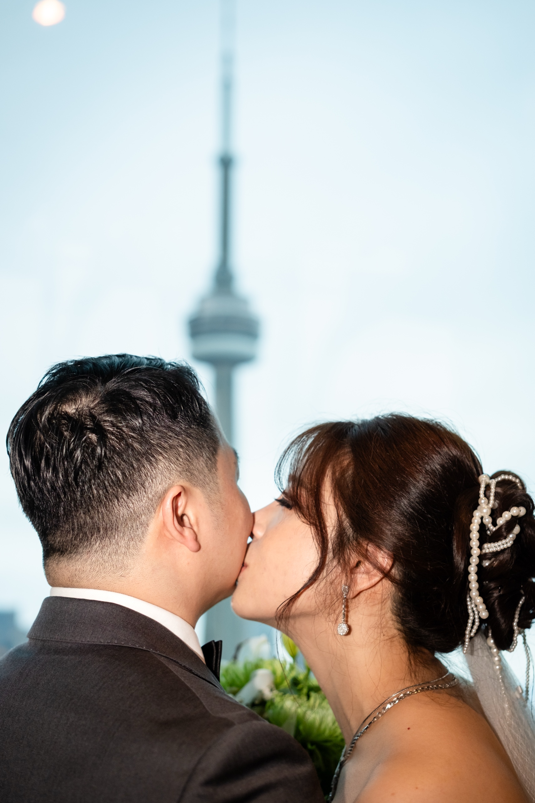
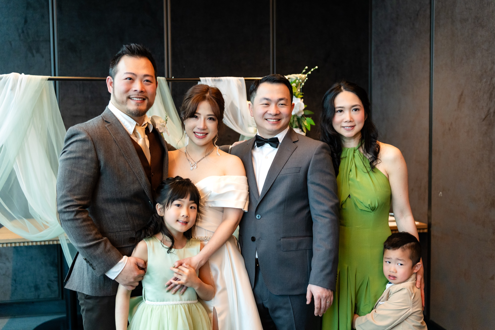
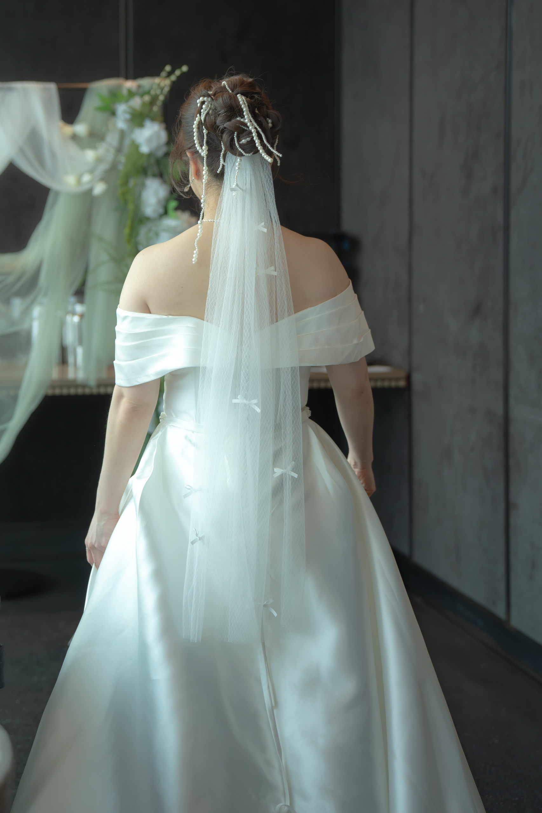
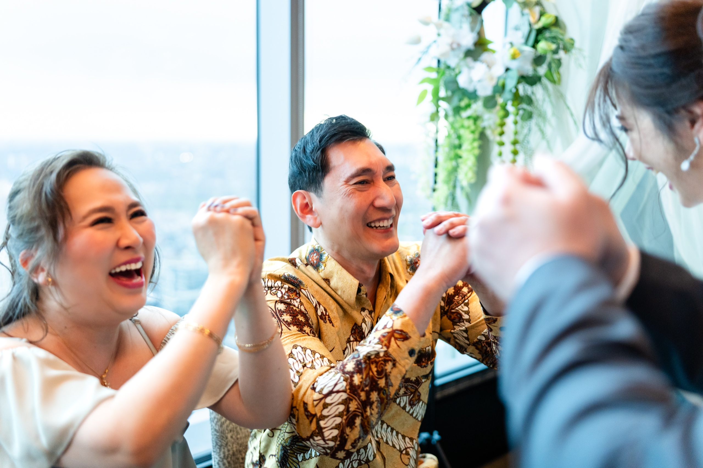

A few weeks ago we photographed Grace and Giovanni's wedding at Aera Toronto, and we've been thinking about it ever since.

It was one of those rare days where everything we love about photographing weddings in downtown Toronto came together in one room. Italian family. A tea ceremony in the afternoon light. A first kiss under a cloud-painted ceiling. Candles moving down a long table while the skyline turned on outside the windows. We want to share what that day actually felt like, and why we think Aera Toronto has quietly become one of the most special wedding venues in the city.

## The Venue: 38 Floors Above Downtown

Aera sits on the 38th floor of CIBC Square, in the heart of downtown Toronto. The first thing you notice when you walk in is the light. Floor-to-ceiling windows wrap the entire dining room, and on a clear afternoon the whole space fills with soft city sun that does most of our job for us.

Look up and you'll see the cloud mural painted across the ceiling. It glows above the long communal table, soft and warm, and gives every overhead shot the feeling of being held inside something gentle. The signature of the room, though, is the arched corridor with the mirror at the far end. Walk down it in a veil and we promise the photos will look like film stills.

For couples planning a wedding here, it's worth knowing that Aera is built around one long family-style table. The whole evening is anchored to it. If you've been imagining an Italian dinner where everyone is in the same conversation, this is the room.

We've put together a fuller breakdown of the space on our [Aera Toronto location guide](/location-guide/aera-toronto/), with notes on light, timing, and what to expect from each part of the room.

## The Tea Ceremony Started Quiet

The day opened with the tea ceremony. Grace held the cup with both hands in front of her grandmother. Giovanni stood close behind her and laughed quietly into the back of her shoulder. The light at that hour was the soft afternoon kind we wait all day for, and it caught the side of Grace's face every time she leaned forward to pour.

That's the first thing we always tell couples about real weddings. The best photographs almost never come from the moments you planned to be photographed. They come from the in-between ones. The looks. The small laughs. The hands you didn't realize were holding each other.

## The Ceremony Under the Cloud Ceiling

A few steps from the tea ceremony, Grace and Giovanni said their vows under the cloud-painted ceiling. The first kiss landed under the arch like something rehearsed only by love. Family in the front row, sun pouring through the windows behind them, the city held at a respectful distance outside the glass.

Afterwards we walked them down the arched corridor for portraits. Grace in her veil moving toward the mirror at the end of the hall, Giovanni waiting for her in the soft glow at the other end. Two minutes of work. Frames we will keep forever.

## An Italian Dinner That Moved Like a Family

By evening the room had turned cinematic. Candle runners ran down the long table from one end to the other, the skyline started to glitter in the windows, and plates kept arriving while the room kept getting louder in the best way.

Toasts went up in one sweeping curve down the table, every face caught in the same warm light. The first dance was small and held tight. The dance floor was loud and joyful. Somewhere in the middle of it all, Grace and Giovanni stole one quiet beat by the window with the whole downtown lit up behind them.

That is what a wedding at Aera Toronto looks like when you let the room do its job. Two people, an Italian table, a city full of light, and not a moment that needed to be staged.

## See the Full Gallery

The full 50-image gallery from Grace and Giovanni's day lives on our portfolio: [Grace + Giovanni at Aera Toronto](/portfolio/grace-giovanni/).

If you're considering Aera Toronto for your own wedding, our [Aera Toronto wedding venue guide](/blog/aera-toronto-wedding-venue-guide/) walks through the best photo spots, the light cycle, and what couples should plan for, from a photographer who has worked the floor.

If you're planning a wedding at Aera Toronto, or anywhere else in the GTA, and you'd like us to photograph it the way we photographed this one, [reach out here](/contact/#inquiry). We always start with a conversation about your day, your family, and the moments that matter most to you.
