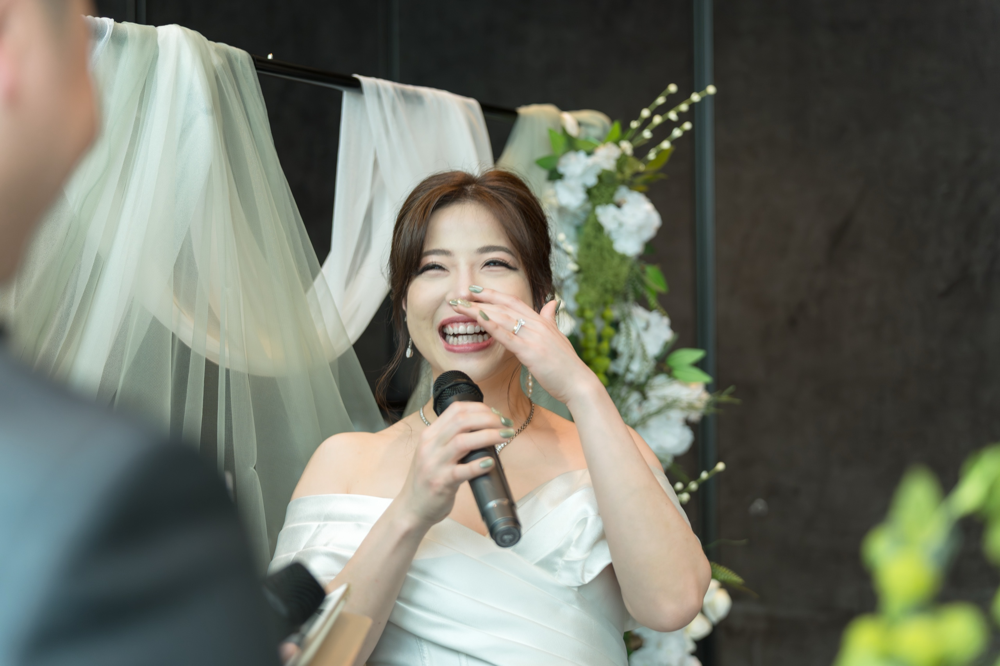
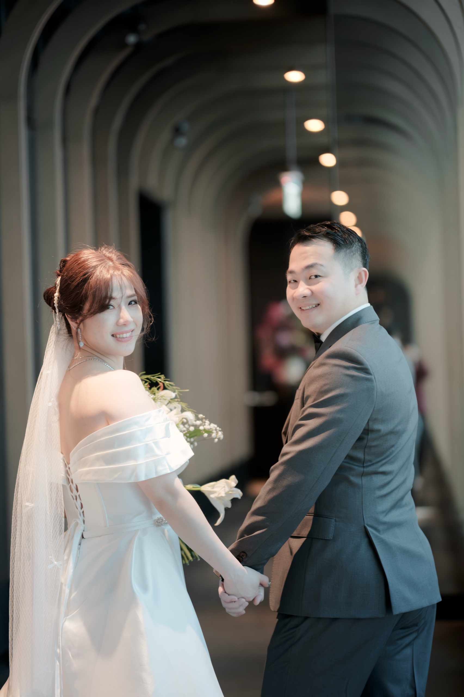
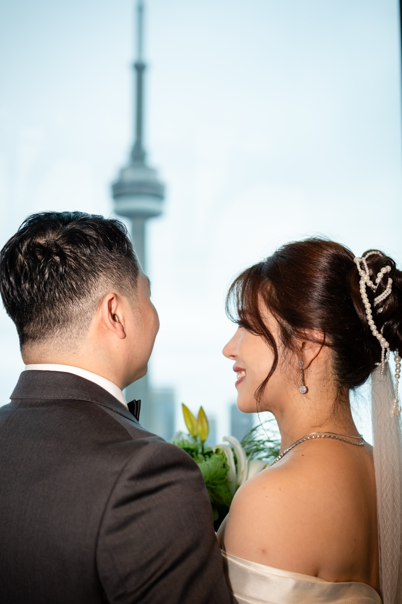
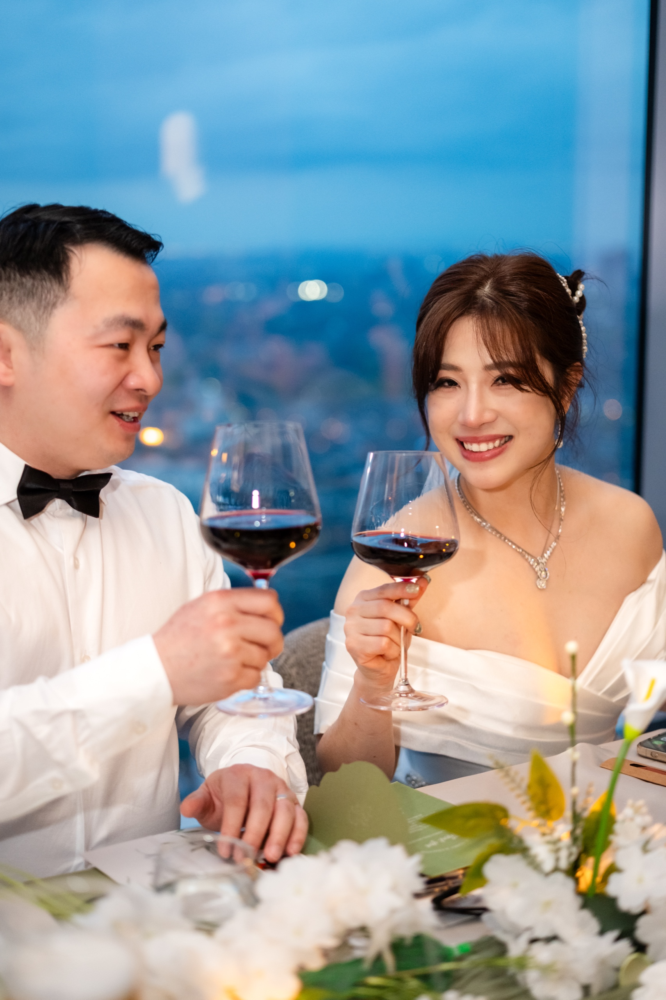
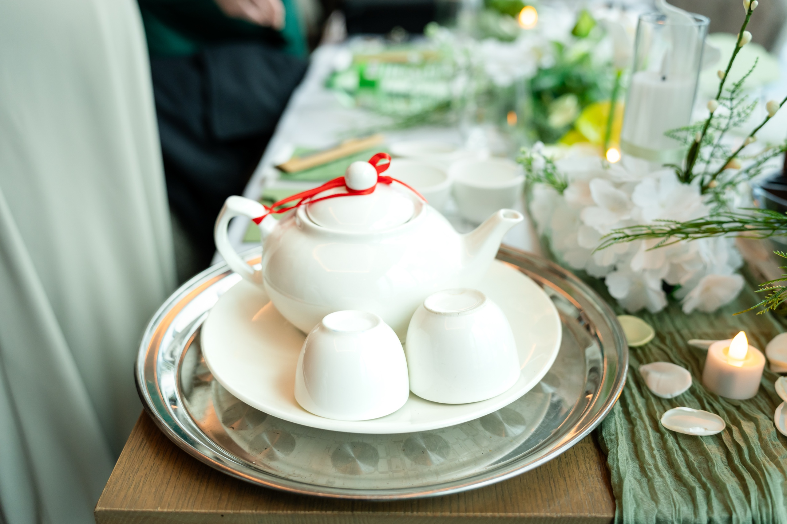
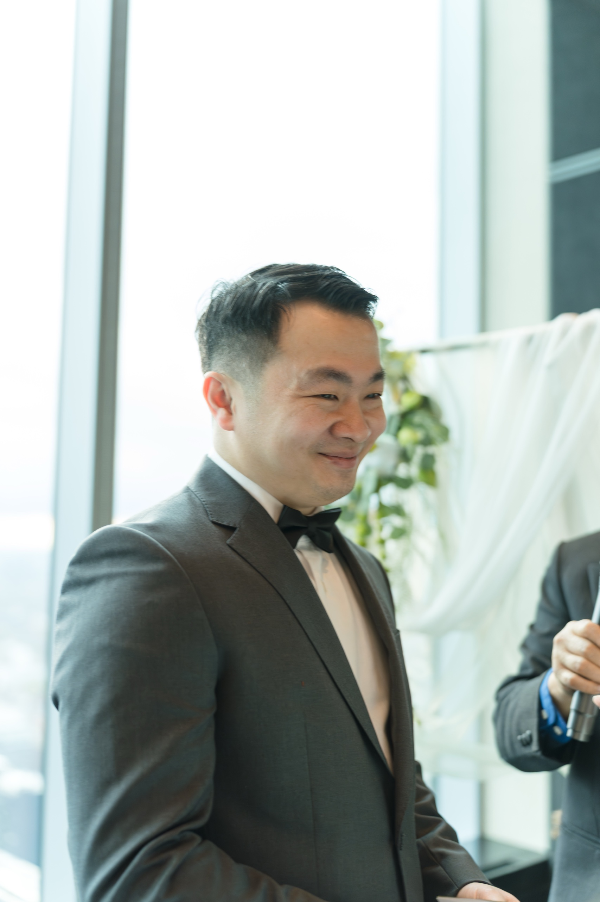
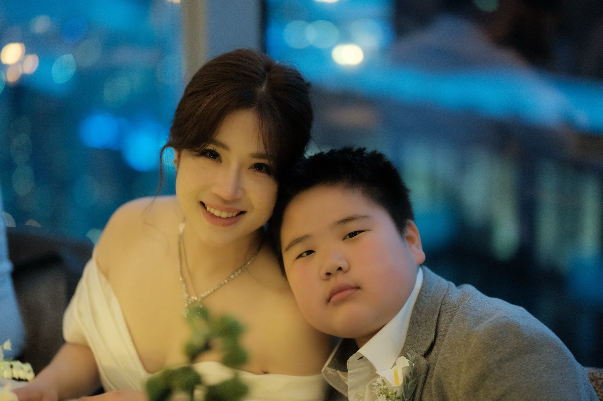
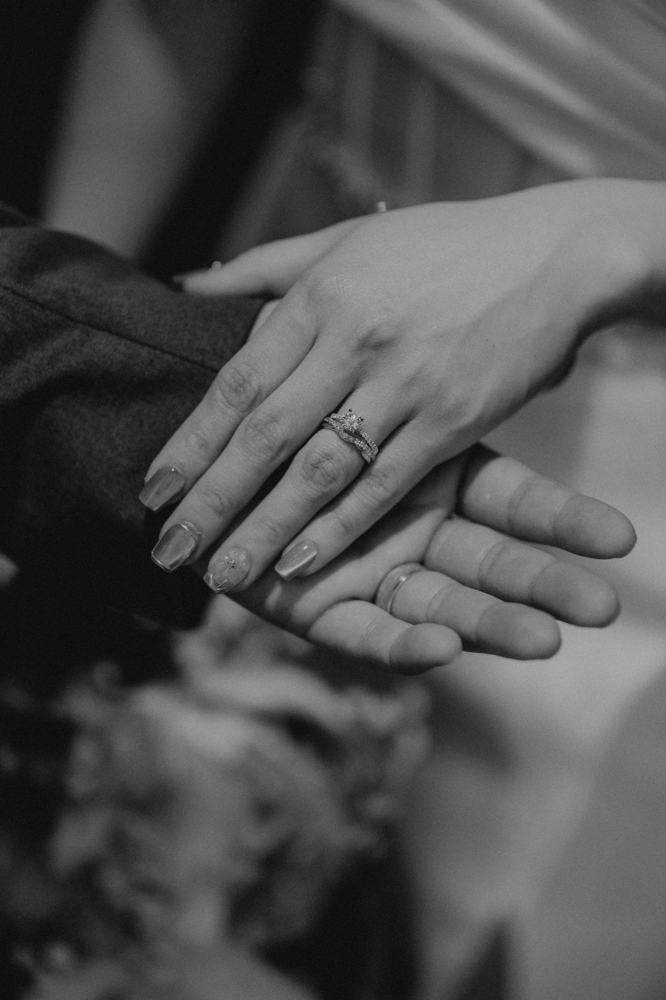
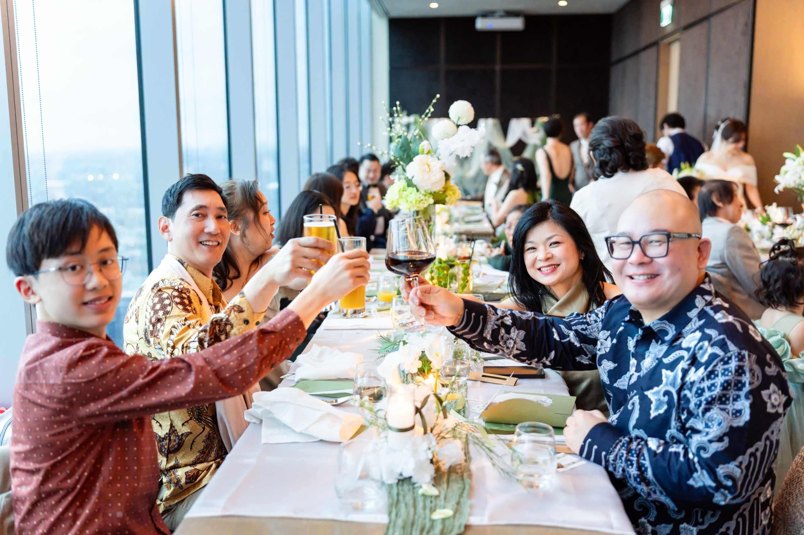

Thirty-eight floors above downtown Toronto, behind the glass walls of CIBC Square, there's a dining room that has quietly become one of the most beautiful wedding venues in the city.

Aera opens onto a wraparound view of the skyline and the lake, with a cloud mural painted across the ceiling and a long family-style table that anchors the entire evening. We've photographed a wedding here recently, and we keep finding ourselves recommending the room to couples who didn't know it existed.

If you're considering Aera Toronto for your wedding, this is the version of the venue we wish we'd had access to before we first walked in. The light. The best corners. What kind of wedding the room is built for. What to plan for, and what to expect from each part of the night. From a photographer who has worked the floor.

## Aera Toronto at a glance

**Location:** 38th floor of CIBC Square, in the heart of downtown Toronto's Financial District. A short walk from Union Station.

**Type:** Private restaurant. Modern Italian. Built around one long communal table.

**Capacity:** Built for intimate to mid-sized weddings. Confirm current numbers directly with the venue.

**Setting:** Indoor, sky-high. Floor-to-ceiling windows wrap the dining room. Warm wood, sage tones, candlelight at night.

**Travel time:** Downtown. Easy by transit, walking distance from Union Station.

**Parking:** Paid public lots at CIBC Square and surrounding Financial District buildings. Most guests arrive by transit or rideshare.

**Walking level:** Low. Elevator access to the 38th floor. No outdoor walking required between settings.

**Photo permit:** Not required. The venue is private. Photography for booked private events is arranged directly with Aera.

**Best season:** Year-round. The room glows in every season.

## What makes Aera Toronto feel cinematic

The first thing every couple notices when they walk in is the light. Floor-to-ceiling windows wrap the entire dining room. On a clear afternoon the room fills with soft city sun that does most of a photographer's work for them. As the day shifts, the skyline outside slowly takes over. Six in the evening turns warm gold. Nine in the evening turns to a thousand small lights on the water.

Look up and you'll find the cloud mural painted across the ceiling. It hangs above the long communal table like a stage backdrop, soft and warm, and gives every overhead shot the feeling of being held inside something gentle.

The room's signature feature is the arched corridor with a tall mirror at the far end. Walk down it in a veil and the frame turns into a film still. We've never met a photographer who didn't reach for that hallway within the first fifteen minutes.

What makes the room rare for a Toronto wedding venue is the combination. You get the high-rise skyline you can't get anywhere else in the city. You also get a warm, candle-lit, dining-room intimacy you usually have to give up to gain the view. Aera holds both. The afternoon is sweeping and city. The evening is warm and family. The transition between the two is the most cinematic stretch of light we shoot all year.

## A real wedding at Aera Toronto

We photographed Grace and Giovanni's Italian wedding at Aera in spring. The pacing of the day mapped almost exactly onto the room's natural light cycle, and that pacing is what makes a wedding here feel cinematic from open to close.

The day opened in the afternoon with a small tea ceremony by the windows. The sun was high and slightly to the south, throwing soft side light across the wood-and-sage interior. Family gathered around. Grace held the cup with both hands in front of her grandmother. The light at that hour is the most forgiving light Aera offers all day.

The ceremony followed under the cloud ceiling. Vows, first kiss, the sun pouring through the windows behind the couple and the city held at a respectful distance outside the glass.

Afterwards we walked them down the arched corridor for portraits. Two minutes of work. Frames we'll keep forever.

By evening the room had turned cinematic. Candle runners ran the length of the long table. The skyline started to glitter outside the windows. Toasts went up in one sweeping curve down the table, every face caught in the same warm light.

The full story of their day lives on our [Aera Toronto real wedding blog](/blog/aera-toronto-wedding-grace-giovanni/). The full 50-image gallery lives on the portfolio: [Grace + Giovanni at Aera Toronto](/portfolio/grace-giovanni/).

## The five best photo spots at Aera Toronto

After working a full wedding day in this room, these are the five spots that produce the strongest frames every time.

### 1. The arched corridor with the mirror

The signature shot of the venue. A long arched hallway with a tall mirror at the far end. Walk a bride down it in a veil and the frame builds itself. Best in the late afternoon when the corridor catches indirect window light. We pull this shot in the first thirty minutes after the ceremony, before anyone has stepped into the hallway with a phone.

### 2. The window wall facing the skyline

Floor-to-ceiling windows wrap the long side of the dining room. Pose two people against them at sunset and you get the entire downtown skyline as backdrop. Best between forty-five minutes before sunset and ten minutes after. The light goes soft amber and the city behind starts to glow.

### 3. The long communal table at dinner

Once the candles are lit and the family is seated, the table becomes its own photograph. Stand at one end and shoot down its length. Candle runners, plates, faces in candlelight, skyline outside. We take this shot at the start of dinner before anyone notices.

### 4. Under the cloud-painted ceiling

Overhead frames under the cloud mural give a softness most ceiling shots don't. Lay a bouquet on the table or shoot the first kiss from below and the mural reads like a painted sky.

### 5. The corner of the room at blue hour

The forty-minute window starting just after sunset is the rarest light Aera offers. The skyline starts lighting up while the room still holds warm candlelight. Pull a couple to a quiet corner of the windows during the natural lull between dinner courses and you get one of the most cinematic frames of the whole night.

## When to shoot at Aera Toronto

**Mid-afternoon (2 PM to 4 PM):** Soft side light pours through the south-facing windows. The most forgiving light Aera offers. Ideal for prep, tea ceremony, getting-ready frames, and family portraits before the ceremony.

**Late afternoon (4 PM to 5 PM):** The sun starts to track across the city. The wood-and-sage interior catches direct warm light from one side. Best window for the ceremony itself.

**Golden hour (the 60 minutes before sunset):** Sweeping warm light across the entire dining room. The skyline outside begins to glow. This is the window for skyline-backed couple portraits.

**Blue hour (the 20 minutes after sunset):** The single rarest light of the day. The city outside starts to light up while the room still holds the last of the warm interior light. We always plan one cinematic frame for this window.

**Evening (after dark):** Candlelight takes over. The skyline outside has fully turned on. Long-table dinner shots, dance floor, and intimate close-ups all happen now. The room is at its most romantic between 8 PM and 11 PM.

**Seasons:** Year-round. Sunset times shift, but the room works in every season. Winter blue hour starts as early as 4:45 PM, summer as late as 9 PM. Plan your ceremony time to the light.

## What couples should plan for

**Timing your ceremony to the light.** The most cinematic stretch of the day at Aera is golden hour through blue hour. If you can time your ceremony to end about forty-five minutes before sunset, you give your photographer the strongest two-hour window of light the venue offers. Talk to your photographer before locking the ceremony time.

**Family-style only.** Aera is built around one long communal table. The entire dinner happens at it. Couples who imagine a typical 200-person sit-down with round tables will find this isn't that kind of room. What you get instead is a single Italian table where every face is in the same conversation and every toast travels the length of the meal.

**Photography terms.** Aera is a private restaurant. Photography for booked private events is arranged directly with the venue. No City of Toronto commercial permit is required. Confirm any restrictions on equipment and timing with the venue when you book.

**Getting in and out.** Guests take the elevator to the 38th floor. Access is straightforward but allow extra time on busy nights when the Financial District has events at street level. Union Station is a short walk for guests taking transit.

**Weather.** The venue is fully indoors. Weather doesn't affect the day directly. Heavy rain or low cloud can pull the skyline out of the windows in the late afternoon. If that matters to your portraits, plan a backup time of day.

**Parking.** Paid lots at CIBC Square and surrounding Financial District buildings. Most guests arrive by transit or rideshare.

## Who Aera Toronto is right for

**You want skyline and intimacy in one room.** Most downtown wedding venues offer one or the other. The high-rise rooftops give the skyline but feel cold. The warm restaurant dining rooms feel intimate but lose the view. Aera is the rare room that holds both. Skyline outside, candlelight inside, no compromise.

**Italian wedding, modern aesthetic.** The room is built for modern Italian dining. The cloud mural, the long table, the cream and sage interior, the family-style format. If you've been planning an Italian, Mediterranean, or European-feeling wedding, this room is built for the menu and the pacing.

**Intimate to mid-size guest count.** Aera works beautifully for couples planning a wedding where everyone is in the same conversation. If your headcount is in the 30 to 100 range and you want every guest in the same room at the same table, this is the venue.

## Frequently asked questions

**How much does a wedding at Aera Toronto cost?**

The venue books private events and pricing depends on the date, guest count, and menu. Aera does not publish a public price list. Inquire directly with the restaurant's events team for current rates.

**Can we have the ceremony and reception at Aera?**

Yes. We've photographed weddings where the tea ceremony, the ceremony, and the dinner all happened in the same room within a few hours. The space is designed to host an entire wedding day in one place.

**Do we need a photography permit?**

No. Aera is a private restaurant. Photography for your booked event is arranged directly with the venue. No City of Toronto commercial permit required.

**What's the best ceremony time at Aera Toronto?**

Aim to end your ceremony about forty-five minutes before sunset. This gives the strongest stretch of light for portraits and the cleanest transition into a cinematic blue-hour dinner.

**Is there a backup if it rains?**

Aera is fully indoors. Weather doesn't affect the day directly. Heavy cloud cover can soften the skyline view in the late afternoon. Build a light backup window into the schedule if that matters to your portraits.

**Is the venue accessible?**

Yes. Elevator access to the 38th floor. No stairs required. Confirm any specific accessibility needs with the venue when you book.

**Where else nearby for outdoor portraits?**

If you want to add an outdoor portrait stretch, the [TD Centre and surrounding Financial District courtyards](/blog/best-toronto-pre-wedding-locations/) are a four-minute walk from CIBC Square. Beautiful architecture, easy in-and-out.

## Photograph your wedding at Aera Toronto

Aera is one of the most quietly cinematic wedding venues in downtown Toronto. If you're planning a wedding here and want a photographer who already knows the room, the light cycle, and the corners that work, we'd love to talk.

[**View wedding photography packages →**](/services/wedding/)

Or [send a note about Aera Toronto](/contact?venue=aera-toronto) and tell us what you're planning. We always start with a conversation about the day, the family, and the moments that matter most.

And if you'd like to see what a full wedding day at Aera actually feels like, our [Grace and Giovanni real wedding story](/blog/aera-toronto-wedding-grace-giovanni/) walks through one from open to close.
