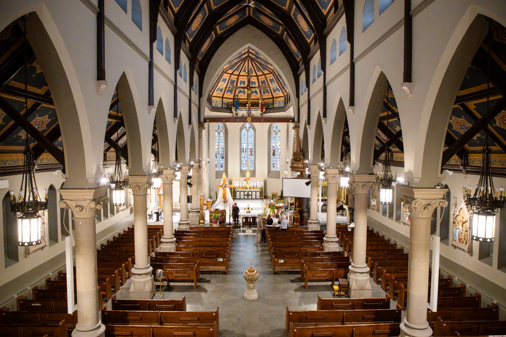
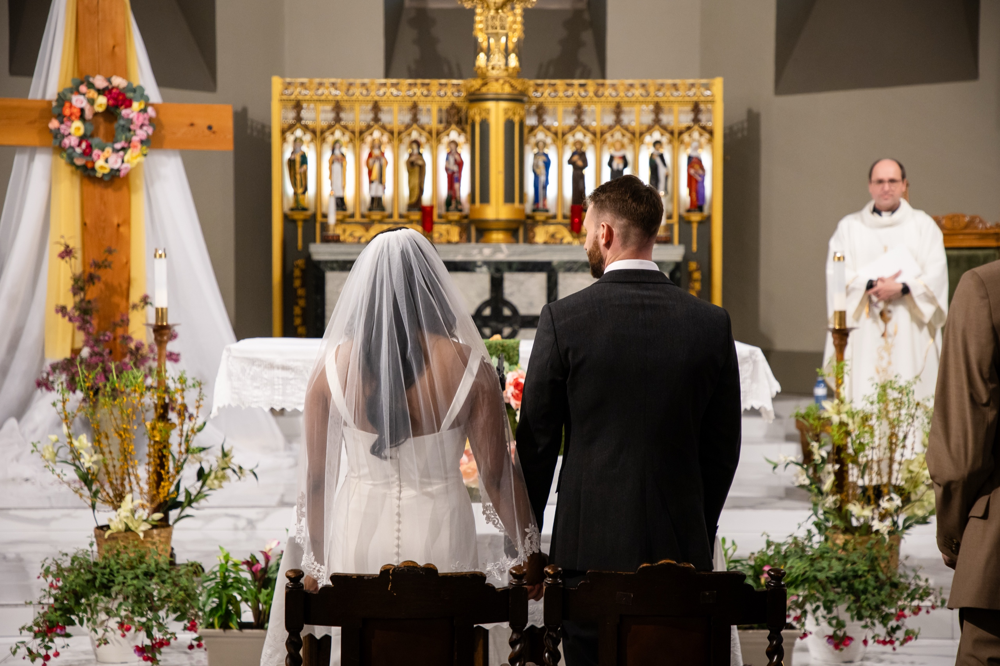
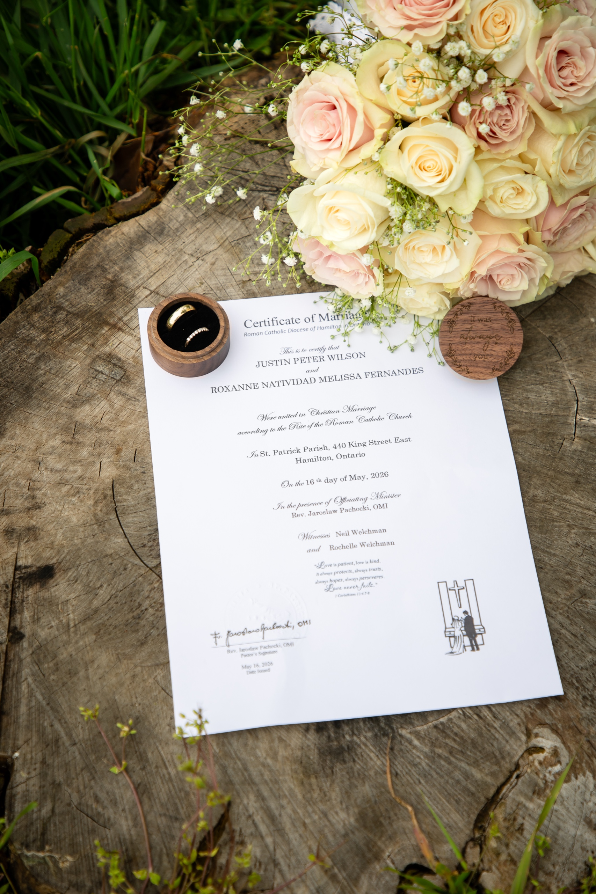

The day opens inside St. Patrick's Catholic Parish on King Street East in Hamilton, a stone Gothic Revival church couples have been quietly photographing for over a century. Light pours through the rose window onto an empty nave. The painted starry vault sits overhead, gold against deep blue. Roxanne walks the aisle on her father's arm, the organ towering behind them, and the room shifts.

A Catholic church wedding carries a weight that no other ceremony quite matches. The architecture, the ritual, the hush before the vows. It also comes with its own set of rules, and they catch a lot of couples and inexperienced photographers off guard.

If you are planning a Catholic church wedding in the GTA, this is an honest guide to what to expect: how the ceremony flows, the photography rules you should know, the timeline reality, and how a church actually photographs. Rules vary by parish and priest, so treat this as the common pattern and always confirm with your own church.

## What a Catholic church wedding is like

The first thing to know is whether your ceremony includes a Mass, because it changes everything about the timeline.

**A Nuptial Mass** is the full ceremony, including communion. It usually runs about 60 to 90 minutes depending on the music, the homily, and the readings.

**A ceremony without Mass**, the Rite of Marriage within a Liturgy of the Word, is shorter, typically 30 to 45 minutes.

**Cultural rituals**, like a cord, veil, coins, or additional blessings, can add 5 to 15 minutes.

Ask your priest early which form your wedding will take. A photographer planning your day needs that answer to build a realistic timeline, and so do you.

## The photography rules every couple should know

This is the part that surprises people, so here it is plainly. Catholic churches almost always have photography guidelines, sometimes written, sometimes spoken, and the priest has the final say. The common ones:

**Flash is often not allowed during the ceremony.** Many parishes prohibit it entirely, especially during the readings, the homily, and the most sacred moments. Some allow a discreet flash only for the processional and recessional. Never assume.

**The photographer stays to the sides and back.** Roaming the centre aisle once the ceremony begins is usually off-limits, and so is moving around during the readings and homily. The good frames come from working quietly at the edges with longer lenses.

**No one stands on the altar or in the sanctuary.** This is nearly universal. Close shots of the vows, the rings, and communion are taken from the side or the front pew, never from the altar steps.

**Quiet matters.** In a silent church, shutter noise carries. Silent shooting modes are the norm for a reason.

**Ask the priest in advance.** A photographer who knows churches will meet or speak with the priest or parish coordinator before the day to confirm where we can stand, whether flash is allowed, and how much time we have inside for photos afterward. This is exactly the kind of thing we handle for you so the day runs smoothly.

None of this limits the photographs in the way couples fear. It just means the person behind the camera needs to know how to work within a church, respectfully and almost invisibly.

## A real Catholic church wedding

Roxanne and Justin were married at St. Patrick's in Hamilton. The processional down that long nave, with the painted vault overhead and the light from the rose window, is the kind of moment a church is built for. We shot it quietly from the side, letting the architecture and the ritual carry the frame.

There is a stillness to the sacred moments, the kneeling at the altar, the vow exchange, the veil pooling on the tile, that you cannot direct and would never want to. You stay back, stay silent, and let it happen. Those restrained frames are often the most powerful of the whole day.

The Gothic narthex doorway frames silhouettes like a postcard, a reminder that a church gives you architectural drama you cannot manufacture anywhere else. You can see the full day, from the church to Dundurn Castle, here: [Roxanne + Justin's Hamilton wedding](/blog/hamilton-wedding-st-patricks-dundurn-roxanne-justin).

## The timeline reality

Church weddings run on the parish's schedule, not yours, and that has real consequences for the day.

**The ceremony length sets everything.** A full Mass finishing around 1 or 2 PM leaves a very different afternoon than a 40-minute ceremony. Know which you are having before you plan portraits and the reception.

**Another service may follow yours.** Many parishes have a baptism, a Mass, or another wedding right after, which can leave you only a short window, sometimes 15 to 30 minutes, for formal photos inside. Confirm this with the church.

**Build real travel buffers.** GTA and Hamilton traffic on a summer Saturday is no joke. Between the church, the portrait location, and the reception, we add 30 to 60 minutes of cushion on top of the drive time. A rushed portrait block shows in the photos.

**A common rhythm after a Mass:** 10 to 20 minutes for a receiving line and congratulations outside, 20 to 40 minutes for family photos at the church if allowed, then 60 to 90 minutes for couple and party portraits at a separate location.

## How a church photographs

A church gives you light and architecture you cannot get anywhere else, if you know how to use it.

**Window light is your friend.** The tall windows and the rose window throw soft, directional light down the nave. We position the key moments to use it rather than fighting it with flash.

**The architecture frames for you.** Arches, the narthex doorway, the long aisle, the vaulted ceiling. These do the composition work. A couple placed in the right spot is framed by the building itself.

**Embrace the dim.** Churches are darker than couples expect. Fast lenses and a steady hand keep the mood intact without blasting the room with light. The slight darkness is part of what makes a church feel sacred on camera.

## What couples should plan for

**Talk to your priest or coordinator about photography early.** Get the rules in writing if you can, and pass them to your photographer. A good one will want to confirm them directly anyway.

**Confirm your post-ceremony window inside the church.** Ask whether another service follows and how long you have for family photos before you need to clear out.

**Plan portraits at a second location.** Most of your couple and party portraits will happen away from the church. If you are in Hamilton, [Dundurn Castle](/blog/dundurn-castle-wedding-photographer-guide) is a natural pairing, the way it was for Roxanne and Justin.

**Hire someone who has shot churches.** This is not the day to find out your photographer does not know church etiquette. The rules are real, and working within them quietly is a skill.

## If a church is not your path

A Catholic church wedding is one beautiful way to marry, but not the only one. If you want something smaller and civil, our guide to a [Toronto City Hall wedding](/blog/toronto-city-hall-wedding-photographer-guide) shows the intimate, no-fuss alternative downtown.

## Frequently asked questions

**Can you use flash during a Catholic wedding ceremony?**

Often not. Many parishes prohibit flash during the ceremony, some allow it only for the processional and recessional. Always ask the priest in advance. We shoot with fast lenses and window light, so flash is rarely needed.

**Where can the photographer stand?**

Usually the side aisles and back, never on the altar or in the sanctuary, and not roaming the centre aisle during the ceremony. Good frames come from working quietly at the edges.

**How long is a Catholic wedding ceremony?**

About 60 to 90 minutes with a full Mass, 30 to 45 minutes without. Cultural rituals add time.

**Do you need permission to photograph in a church?**

You need the parish's photography rules, set by the priest, not a city permit. We confirm them before the day.

**How much time for photos after?**

A short receiving line, 20 to 40 minutes of family photos at the church if allowed, then 60 to 90 minutes of portraits elsewhere, plus generous travel buffer.

## Photograph your church wedding

A Catholic church wedding deserves a photographer who understands its rhythm and its rules, and who can work within them quietly while still capturing the weight of the day. If you are planning a church wedding in the GTA or Hamilton, we would love to talk.

[**View wedding photography packages →**](/services)

Or [send a note about your church wedding](/contact?venue=church-wedding) and tell us your parish and your date. We always start with a conversation about the day, the people, and the moments that matter most.
