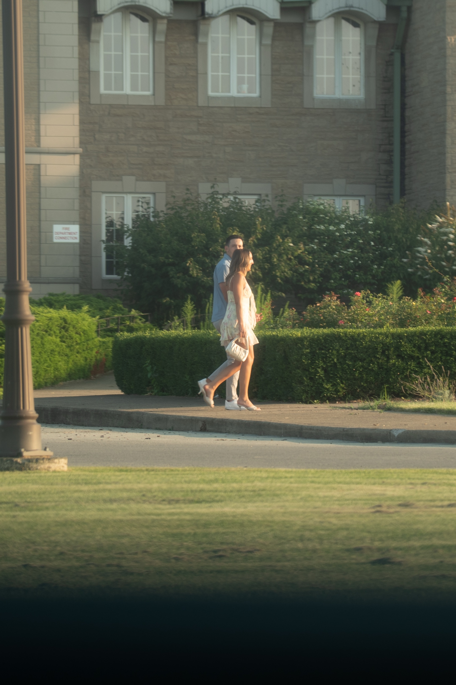
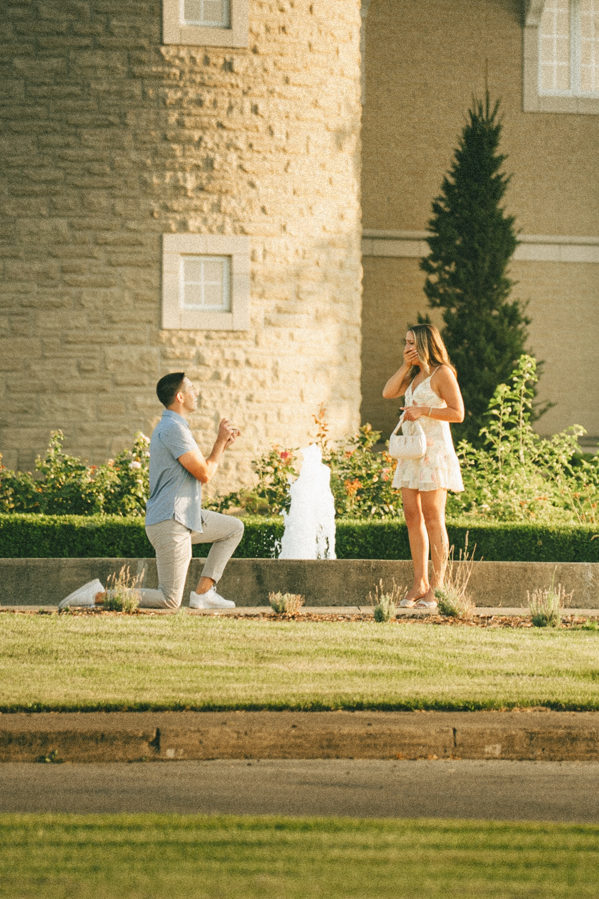
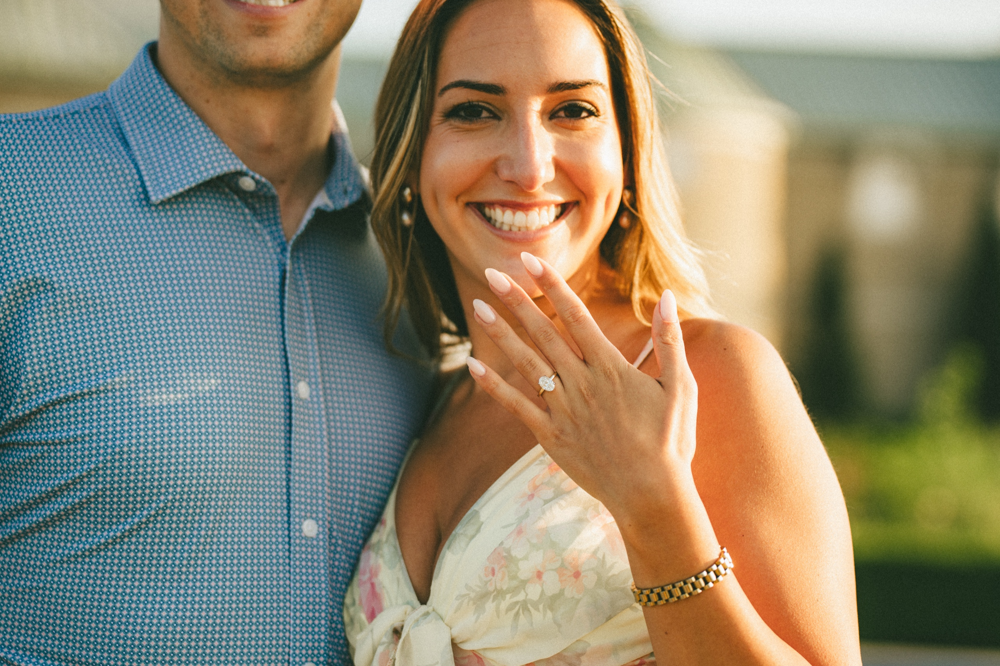
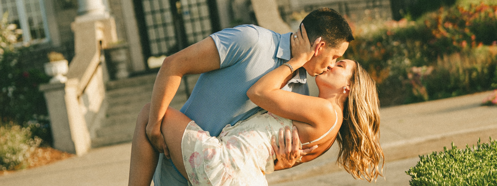
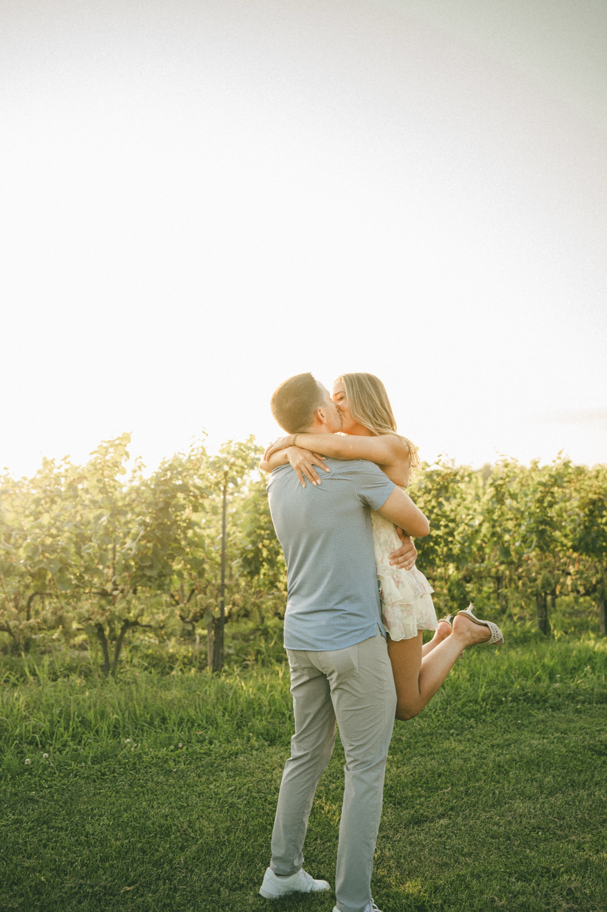
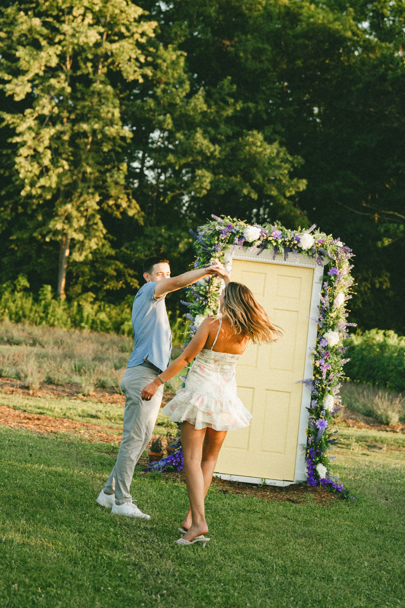
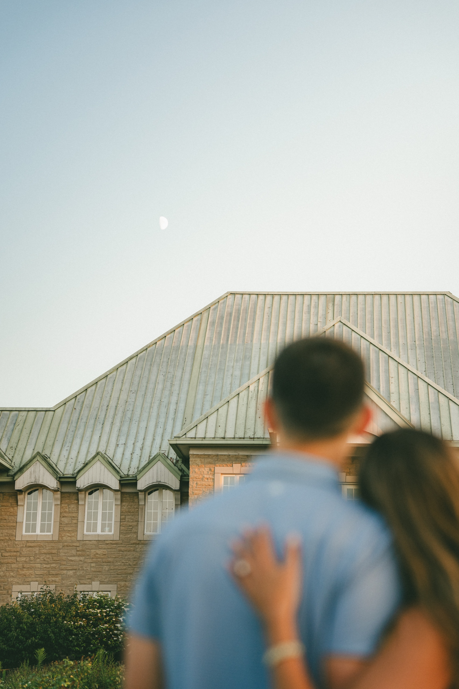

You spend most of a surprise proposal standing in the open, pretending to photograph a building.

That is what I was doing on the evening of August 21, well back across the lawn at Château des Charmes, with a long lens and a bored expression, while Ashley and Donald walked up the path with no idea I was there. I could not hear any of it. I could only watch her stop.

She still had her handbag over her arm when she said yes. Small cream bag, hooked at the elbow, still there when she folded onto the stone to kiss him. Nobody plans that part, and it is the part I would keep.

Château des Charmes is a French style winery in St. Davids, about ninety minutes from Toronto. Here is how to propose there.

## Château des Charmes at a glance

**Location:** 1025 York Road, St. Davids, Niagara on the Lake. On the St. Davids Bench, minutes inland from the old town, off the QEW at the 405.

**What it is:** The Bosc family estate winery, making estate wines since 1978. Paul Bosc was the first in Canada to open a commercial vineyard to visitors. Around 280 acres across four vineyards.

**Setting:** Pale limestone in French château style, a steep green roof with dormers, a round corner tower. A formal fountain out front, ringed with boxwood and rose beds. Vines on three sides.

**Getting there:** About ninety minutes from downtown Toronto down the QEW. Closer to two hours on a summer weekend.

**Access:** A private working winery, not a public park. Grounds open in business hours, and the property hosts weddings and events. Anything planned goes through the events team.

**Best light:** The last ninety minutes before sunset. The winery says the light between 6 and 7 PM in August is completely different. It is.

**Best season:** July and August, vines full and lavender in colour. The Yellow Door stays up through October.

## The proposal

I got there early and walked the property once. The fountain sits at the front of the château in a bed of boxwood and roses, the round limestone tower straight behind it. That was the spot. Then I found somewhere to stand far enough away to be nobody: across the lawn, behind a hedge line, watching the sidewalk.

They came in from the left, a lamppost cutting the frame in half. Ashley in a white floral dress and heels, Donald in a light blue shirt. Nothing in the way she walks says she knows.

Then he stopped by the rose beds and went down on one knee.

Her hand went to her mouth and stayed there. Then she came down onto the stone edge with him and folded in, bag and all.

After that the property was theirs. She held her hand up so the ring caught the sun and laughed at it. He dipped her on the drive by the entrance columns, and she looked back over her shoulder on the way out.

Then a bottle of champagne appeared and she carried it overhead into the vines. The full set is in the [Ashley and Donald gallery](/portfolio/ashley-donald/).

## Out in the vines

The vineyard behind the château is where the evening opens up. Mown grass rows, low sun straight down them, nobody else out there.

They ran a row hand in hand. He lifted her off her feet at the end of it, backlit, and I let the highlights blow out.

Linked fingers walking a row, both faces out of shot. The two of them mirrored on the lawn above the vines, arms flung wide.

Then the lavender. Terre Bleu, the Ontario lavender company, has its Yellow Door standing on its own in the rows this season, wrapped in purple and white flowers. Ashley and Donald went down on the grass in front of it and did the proposal again, laughing this time.

He spun her in front of the door. Then she put her cheek on his shoulder at the edge of the lavender and closed her eyes.

Back at the fountain at dusk the moon was already up over the roof, so I kept the roof and the moon sharp and let the two of them dissolve.

The frame the gallery ends on is the two of them walking into the sun at the end of the rows. Their backs, the vines, nothing else.

## Where to stand: the five best corners

### 1. The fountain and the front

The anchor. Limestone, green roof, clipped boxwood, a formal fountain. It reads as France in every frame.

### 2. The rose beds under the tower

The proposal spot. Your partner arrives facing the round tower with the fountain behind. What makes it work is what sits opposite: an open lawn and a hedge line, far enough back that a photographer stays invisible in plain sight.

### 3. The entrance and the hedge lined drive

Columns, stone steps, a straight drive with hedges down one side. The dip and look back corner. Movement reads well because the lines behind you are straight.

### 4. The vineyard rows and the lawn above them

Where the light does the work. Rows run long and the sun comes across them, so running frames, lifts and backlit shots live here.

### 5. The Lavender & Vine garden

Seasonal, and worth planning around. The Yellow Door stands alone in the lavender rows with flowers up both sides, a set piece you did not have to build. Up through October, lavender peaking in July and August.

One bonus: at dusk the moon comes up over the roofline. There is a frame in that.

## How a hidden proposal shoot works at a winery

A winery is private property, so the mechanics differ from a park.

**Pick the exact spot in advance.** Not the winery, but which side of the fountain, facing which way, at what time.

**Tell the winery a photographer is coming.** Contact the events team ahead of the date. They run weddings and events here, so it is a normal request. The winery also has its own proposal package.

**I arrive early and work from a distance.** Long lens, casual clothes, standing across the lawn. Nobody looks twice at someone photographing a château.

**Your partner arrives on a cover story.** A tasting booking explains the drive, the outfit and the timing at once.

**Then the session.** After the yes I walk over and we shoot the fountain, the vines and the lavender. Nobody is more relaxed in front of a camera than in the hour after a yes. See our [proposals portfolio](/portfolio/proposals/).

## Small things that make a proposal here land

**Sort access first.** Email the events team rather than hoping.

**Use the tasting as the cover.** The most natural reason to be at a winery at 6 PM, dressed up.

**One bottle and one person, at most.** A crowd turns a private moment into a performance.

**Plan for heels on grass.** Ashley wore heels on the lawn and it worked, but keep flats in the car for the rows.

**Wear light colours.** Cream, white and light blue against limestone and green.

**Book dinner after.** St. Davids or the old town, minutes away. You will want to sit down and call everyone.

**Leave the glow some time.** The drive home is ninety minutes.

## When to go

**Golden hour.** The last ninety minutes before sunset. In late August that is roughly 6:30 to a little after 8. Sunset the evening we shot was just after 8 and we ran to last light.

**July and August** for the lavender and the fullest vines. The Yellow Door is up through October, so a September date still gets it.

**Weekday evenings** if you can. Weekends in August are busy and the winery says so itself. A seasonal food menu runs on the terrace Friday to Sunday.

## Who Château des Charmes is right for

**You want it to look like France without the flight.** Limestone, a green roof, a tower, a fountain.

**You want a garden, a vineyard and a building in one place.** Carved stone to open vines in under a minute.

**You want a real reason to be there.** A tasting holds a surprise together better than a vague drive.

**You are combining a proposal with an engagement session.** One evening covers both without repeating a backdrop.

More proposal work: [Margarita and Mike at the Toronto Music Garden](/blog/toronto-music-garden-proposal-photography/) and [Lavina and Raeed at Guild Park](/portfolio/lavina-raeed/). The [Niagara on the Lake location guide](/location-guide/niagara-on-the-lake/) covers the area, the [Niagara Parks Botanical Gardens guide](/blog/niagara-parks-botanical-gardens-wedding-photographer-guide/) is the public garden alternative, and [what to wear for a pre-wedding shoot](/blog/what-to-wear-pre-wedding-shoot/) handles outfits.

## Frequently asked questions

**Do you need permission to propose or take photos at Château des Charmes?**

It is a private working winery, not a public park. The grounds are open in business hours, and the Lavender & Vine garden is a ticketed seasonal experience. Contact the events team ahead of your date and say a photographer is coming. They also run their own proposal package.

**Where is it and how far is it from Toronto?**

1025 York Road, St. Davids, off the QEW at the 405. About ninety minutes from downtown Toronto, closer to two on a summer weekend.

**What is the Yellow Door, and when is the lavender out?**

A Terre Bleu installation in the vines and lavender rows, part of the Lavender & Vine experience launched July 1, 2026. Self guided entry is $25, guided with a seated tasting is $45. The door is up through October, the lavender is best in July and August.

**What time should we book?**

The last ninety minutes before sunset, on a weekday if you can.

**How does a surprise proposal shoot work here?**

I work from across the lawn with a long lens while your partner walks in on a cover story. After the yes, we shoot a full session.

**What should we wear?**

Light colours against limestone and green. Flats in the car for the vineyard rows.

## Photograph your proposal at Château des Charmes

If you are planning to propose at Château des Charmes and you want someone who already knows where to stand, how far back the hidden vantage sits, and what the light does to that limestone at seven, tell us the date you have in mind.

We shoot proposals across Niagara and the GTA. The hour after the yes is the part we care about most.

[**View the proposal package →**](/services/pre-wedding/#proposal-package)

Or [send a note about Château des Charmes](/contact?venue=chateau-des-charmes) with your date and we will help you pick the spot.
