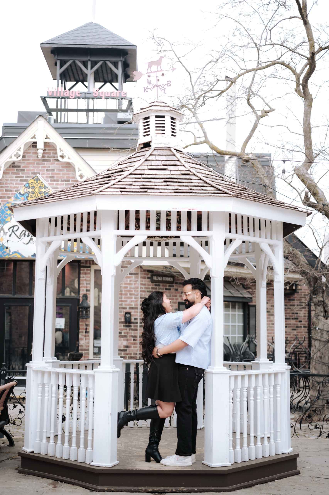
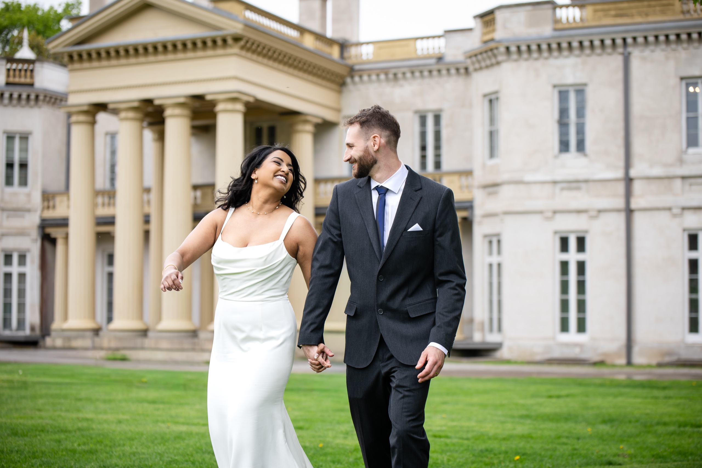

Vikrant and Sahib drove in from out of town for a single afternoon, both of them in head-to-toe black, his suit clean and quiet, her gown long and architectural. We started at Dundurn Castle, and the castle did most of the heavy lifting. The tall columned facade, the parkland dotted with old bare-limbed trees, the whole estate reading like somewhere in Europe rather than an hour down the highway from Toronto.

Dundurn Castle is one of the strongest under-the-radar locations for wedding and engagement photography just outside the city. An 1830s Italianate villa on a rise above Hamilton Harbour, with a columned portico, a tree-lined drive, and wide grounds that turn every portrait into something architectural.

If you are planning wedding or engagement photos at Dundurn Castle, this is a photographer's guide to the estate. The best spots, the light, and the one thing to sort out before you arrive.

## Dundurn Castle at a glance

**Location:** 610 York Boulevard, Hamilton, on a rise overlooking Hamilton Harbour. About an hour from downtown Toronto.

**What it is:** An 1830s Italianate villa and historic house museum, the Dundurn National Historic Site, operated by the City of Hamilton.

**Setting:** A grand stone estate with a columned portico, a curved rotunda entrance, a tree-lined driveway, and wide parkland on the bluff above the harbour.

**Access:** A City of Hamilton historic site, not a public park. A portrait session is usually a booked use, so confirm booking, fees, and hours with Dundurn directly.

**Interior:** The house is a museum with tours. Interior photography is generally restricted and separate from grounds photography.

**Best light:** Late afternoon and golden hour, when the facade warms and the allee backlights.

**Best seasons:** Year-round. Bare-limbed trees in early spring and late fall give the grounds a striking European look.

## What makes Dundurn Castle feel cinematic

The architecture is the whole pitch. Dundurn is a proper Italianate villa, symmetrical and grand, with a tall columned facade and a portico that gives you steps, columns, and scale all in one frame. The curved rotunda entrance adds a softer architectural detail, and the stonework photographs warm in late light.

Then there is the land around it. The estate sits on a rise above Hamilton Harbour, surrounded by wide parkland dotted with mature trees. In early spring and late fall, when those trees are bare-limbed, the grounds read distinctly European, almost like an old English estate. A long tree-lined driveway runs up to the house, and it makes a dramatic leading line for walking shots and backlit portraits at sunset.

For a photographer, Dundurn gives you grandeur without much effort. Place a couple in front of those columns, or walk them up the allee with the light behind, and the estate does the composition for you.

## Real sessions at Dundurn Castle

Vikrant and Sahib's pre-wedding session opened here, the two of them in sharp black against the pale stone of the facade. The castle gave us a grand, quiet first act before the day moved on to the lakefront at Burlington. There is a stillness to the estate that suits formal, architectural portraits.

The tree-lined drive is one of the best features on the property. Walk a couple up it with the light behind them and you get a natural leading line, depth, and that European-estate feeling in a single frame.

Dundurn also closed out Roxanne and Justin's Hamilton wedding day, after their ceremony at St. Patrick's Parish. The Italianate facade and the columned portico turned the final portraits of the day into something architectural and grand. You can see their full wedding here: [Roxanne + Justin's Hamilton wedding](/blog/hamilton-wedding-st-patricks-dundurn-roxanne-justin/).

## The best photo spots at Dundurn Castle

### 1. The columned portico and facade

The signature shot. The tall columns, the steps, and the symmetrical Italianate facade give you formal grandeur and room for couple portraits or family groupings. Best in late afternoon when the stone goes warm.

### 2. The tree-lined driveway

The allee running up to the house is a natural leading line. Perfect for walking shots and for backlit frames at golden hour, with the trees framing the couple on both sides.

### 3. The parkland and old trees

The wide grounds dotted with mature trees read European, especially in early spring and late fall when the branches are bare. Great for more relaxed, landscape-feel portraits with the estate in the distance.

### 4. The grounds overlooking the harbour

The rise above Hamilton Harbour gives you wider portraits with sky and water beyond, ideal for the last warm light of the day.

### 5. The rotunda entrance

The curved rotunda detail is a quieter architectural backdrop for closer, more intimate frames away from the grand facade.

## When to shoot at Dundurn Castle

**Late afternoon:** The facade catches warm directional light and the columns gain depth. The best window for formal portraits.

**Golden hour:** Walk the tree-lined drive with the sun behind for backlit, glowing frames. The grounds overlooking the harbour open up here too.

**Seasons:** Year-round. Early spring and late fall give you the bare-limbed, European-estate look. Summer brings full green canopy. Winter on the stone can be striking if the grounds are accessible.

## What couples should plan for

**Confirm access first.** Dundurn is a City of Hamilton historic site, not an open public park, so a portrait session is usually a booked use. Check with Dundurn directly on whether a booking or fee applies for your date, the hours, and any rules around tripods or drones. Heritage-site policies change, so do this before you commit it to the timeline.

**Interiors are a museum.** The historic house runs guided tours, so plan your session for the exterior. Confirm any interior access separately if you have your heart set on it.

**Parking.** On-site and nearby parking is generally available. Confirm the day-of arrangement when you check access.

**Pair it with the harbour or Burlington.** Dundurn sits minutes from Hamilton Harbour and a short drive from Burlington's waterfront and village. We often build a session that opens at the castle and softens into the lakefront, the way we did with Vikrant and Sahib.

## Who Dundurn Castle is right for

**You want grand architecture outside the city.** Dundurn gives you Italianate-villa scale and European parkland an hour from Toronto, without competing for space with downtown crowds.

**You are getting married in Hamilton or Burlington.** If your wedding is in the area, Dundurn is the natural place for portraits, and it pairs beautifully with a church ceremony nearby.

**You love a formal, architectural look.** Columns, symmetry, and a tree-lined drive. If your taste runs classic and grand rather than soft and rustic, this estate delivers.

## Frequently asked questions

**Where is Dundurn Castle?**

610 York Boulevard, Hamilton, overlooking Hamilton Harbour, about an hour from downtown Toronto.

**Can you take wedding photos there?**

Yes, on the grounds. It is a City of Hamilton historic site, so confirm booking, fees, and hours with Dundurn directly before your date.

**What's the best spot?**

The columned portico and facade, the tree-lined driveway, the parkland, and the grounds above the harbour.

**Can you photograph inside?**

The house is a museum with restricted interior photography. Plan your session for the exterior and confirm any interior access with the site.

## Photograph your day at Dundurn Castle

Dundurn Castle is one of the most architectural locations in the Hamilton area, grand and quiet and made for formal portraits. If you are planning a wedding or engagement session here and want a photographer who knows the estate and how to work the light, we would love to talk.

Shooting elsewhere in the city? Here is how I approach a [Hamilton wedding](/wedding-photographer-hamilton/).

[**View wedding and pre-wedding packages →**](/services/wedding/)

Or [send a note about Dundurn Castle](/contact?venue=dundurn-castle) and tell us what you are planning. We always start with a conversation about the day, the people, and the moments that matter most.

Quick-reference version: the [Dundurn Castle location guide](/location-guide/dundurn-castle/) has the parking, permit, and walking notes on one page.
