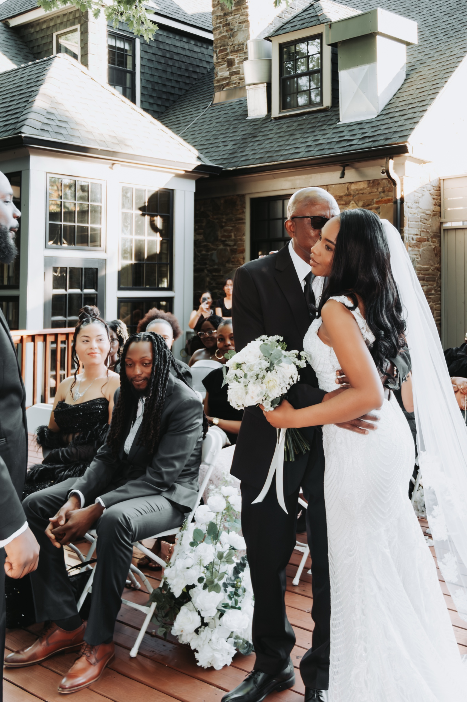
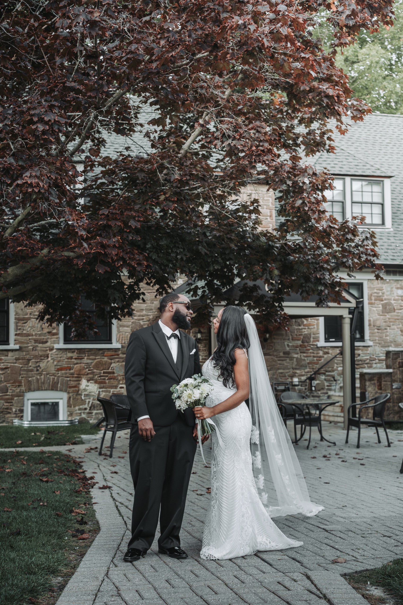

Some weddings hit you the moment you walk in. With Natalie and Shavar, it was the ceremony deck. White florals climbing a gold arch, tall maples filtering the September light, and the feeling that you had stepped into someone's private garden. Shavar was already up there with his groomsmen and his son, adjusting his bow tie, looking calm but counting the seconds. When Natalie came down the aisle on her dad's arm, the whole deck went quiet.

The Glenerin Inn is one of the GTA's best-kept secrets for couples who want an estate wedding without the two-hour drive to cottage country. A historic stone manor tucked into a wooded ravine in Mississauga, with a ceremony deck under old-growth maples and a domed reception room that turns cinematic once the candles come on.

If you are considering The Glenerin Inn for your wedding, this is a photographer's look inside. The best spots, the light, and what to know before you book.

## The Glenerin Inn at a glance

**Location:** 1695 The Collegeway, Mississauga, in the Erindale and Sawmill Valley area near UTM. About 30 minutes from downtown Toronto.

**What it is:** A historic stone estate inn and spa that operates as a full-service wedding venue and hotel, with an in-house events team.

**Setting:** A stone manor nestled in a wooded ravine, with an outdoor ceremony deck under mature maples and characterful interior reception rooms.

**Ceremony:** Outdoors on the tree-canopied deck, weather permitting.

**Reception:** Indoor rooms including a domed space with arched windows and warm sconces.

**On site:** Overnight accommodation and a spa, which makes getting-ready and morning-after coverage easy.

**Photo access:** Part of your venue booking. No public permit needed.

## What makes The Glenerin Inn feel cinematic

The setting does the work. The inn sits down in a ravine surrounded by mature trees, so the moment you arrive the noise of the city falls away and you are in what feels like a private estate. The stone manor has gables, dormers, terraces, and the kind of weathered texture that photographs rich and warm.

The ceremony deck is the heart of it. A canopy of tall maples sits directly overhead, and on a clear day the light filters down through the leaves in soft, dappled patches. That is light you cannot rent or rig. It wraps around faces, glows on a white dress, and gives the whole ceremony an airy, garden quality.

Inside, the mood changes completely. The domed reception room, with its arched windows and warm wall sconces, turns into something out of a period film once the candles are lit. So you get two distinct looks in one venue: bright and natural outdoors, warm and old-world indoors. For a photographer, that range in a single location is a gift.

## A real wedding at The Glenerin Inn

Natalie and Shavar were married on the ceremony deck on a September afternoon. The light through the maples was doing exactly what it does best, soft and golden and full of movement. There is a stillness to an outdoor ceremony under old trees that an indoor room cannot replicate, and the deck at Glenerin has it in spades.

When Natalie came down the aisle, the deck went quiet in the way that matters, the kind where everyone forgets the camera is there. Those are the frames we are really after, and a venue this intimate makes them easy to find.

By evening we were inside, in the domed room with the candles lit and the sconces glowing. The shift from the bright garden ceremony to the warm interior gave the day a natural arc. A day this seamless does not happen on its own. Natalie and Shavar's wedding was planned and coordinated by [Tsunki Event Planning](https://www.instagram.com/tsunkiep/), who kept the whole evening flowing so everyone, us included, could just be present for it. The full gallery from their wedding is here: [Natalie + Shavar at The Glenerin Inn](/portfolio/natalie-shavar).

## The best photo spots at The Glenerin Inn

### 1. The ceremony deck under the maples

The signature spot. Dappled light through the canopy, greenery on every side, and a sense of seclusion. Best for the ceremony itself and for soft, natural couple portraits right after. Aim for mid to late afternoon when the light through the leaves is warmest.

### 2. The stone manor facade

The weathered stone of the main building gives you a classic, old-world backdrop with texture in every frame. Good in soft overcast light or late afternoon, when the stone goes warm.

### 3. The wooded ravine paths

Step off the deck and the landscaped paths through the ravine give you secluded, green portraits and first-look spots. Beautiful in early fall when the leaves begin to turn.

### 4. The domed reception room

Once the candles are lit, this is your cinematic interior. Warm sconces, arched windows, and a domed ceiling that reads like a period film. The spot for evening portraits and the warm, glowing reception frames.

### 5. The terraces and grounds

The terraces around the manor give you wider establishing shots and room for family groupings, with the stone and the trees behind.

## When to shoot at The Glenerin Inn

**Afternoon ceremony:** The maple canopy is at its best in mid to late afternoon, when the light filters warm and soft through the leaves.

**Golden hour:** Step into the ravine or onto the grounds for the last warm light of the day before dinner.

**Evening, indoors:** The domed room and candlelight take over after sunset, so night portraits have a warm, intimate glow rather than a flat flash look.

**Seasons:** September and early October are ideal, with full canopy and the first hint of colour. The stone and the interiors carry a winter or rainy-day wedding beautifully, which makes Glenerin a safe choice in any season.

## What couples should plan for

**It is a working inn.** There may be overnight guests and sometimes more than one event on a weekend. Coordinate your timeline with the events team so you know which spaces are exclusively yours and when. This matters for photos, since it determines where and when we can shoot.

**Lock your photo window in the contract.** If you want early getting-ready coverage, a first look, or night portraits, confirm those access times in your event order. The venue books directly through its in-house team, so it is a simple conversation to have up front.

**Rain backup.** The domed reception room is a genuinely beautiful indoor alternative, so a rainy ceremony is not a disaster here. We will still get warm, intentional frames.

**Parking and access.** On-site parking for guests and vendors. Confirm any restrictions for evening photos or drones with the venue.

**Pair it in the cluster.** If you are comparing GTA estate venues, our guides to [Adamson Estate](/blog/adamson-estate-wedding-photography-guide) and [Aera Toronto](/blog/aera-toronto-wedding-venue-guide) show two other distinct looks, lakefront heritage and downtown modern.

## Who The Glenerin Inn is right for

**You want an estate wedding without the long drive.** Glenerin gives you secluded woods, stone, and a private-garden feel 30 minutes from downtown, not two hours up the highway.

**You love the idea of getting married under trees.** The maple-canopy ceremony deck is the whole pitch. If an outdoor garden ceremony is your dream, this is one of the best in the GTA.

**You want one venue that does both moods.** Bright natural ceremony, warm candlelit reception, plus rooms and a spa on site. Everything in one place, which keeps the day calm.

## Frequently asked questions

**Where is The Glenerin Inn?**

1695 The Collegeway, Mississauga, in the Erindale area near UTM, about 30 minutes from downtown Toronto.

**Can you get married there?**

Yes. It is a full-service wedding venue and hotel with an in-house events team and an outdoor ceremony deck under the maples.

**What's the best spot for photos?**

The ceremony deck under the maples, the stone facade, the wooded paths, and the candlelit domed room.

**Is it good for a winter or rainy wedding?**

Yes. The domed reception room and characterful interiors carry an indoor day beautifully.

**Do you need a permit?**

No. Photo access is part of your venue booking. Just confirm your photo window in the contract.

## Photograph your Glenerin Inn wedding

The Glenerin Inn is one of the GTA's quietest, most cinematic estate venues, with a garden ceremony and a candlelit reception in one place. If you are planning your wedding here and want a photographer who knows the deck, the light, and the domed room, we would love to talk.

Planning a Mississauga wedding? See how I cover the city on my [Mississauga wedding photographer](/wedding-photographer-mississauga/) page.

[**View wedding photography packages →**](/services/wedding/)

Or [send a note about The Glenerin Inn](/contact?venue=glenerin-inn) and tell us what you are planning. We always start with a conversation about the day, the people, and the moments that matter most.
