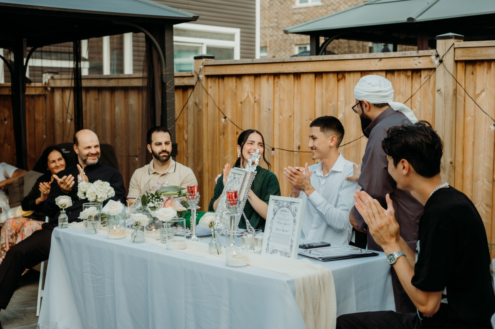
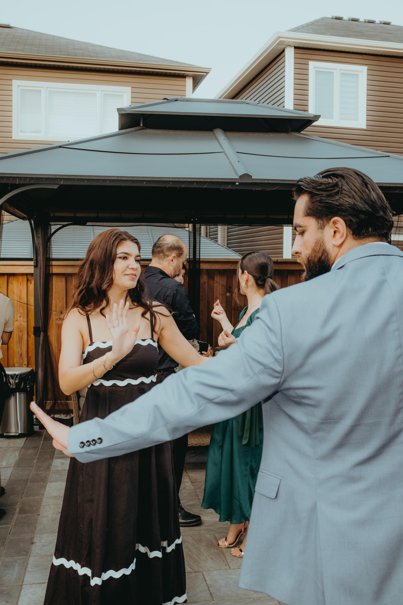
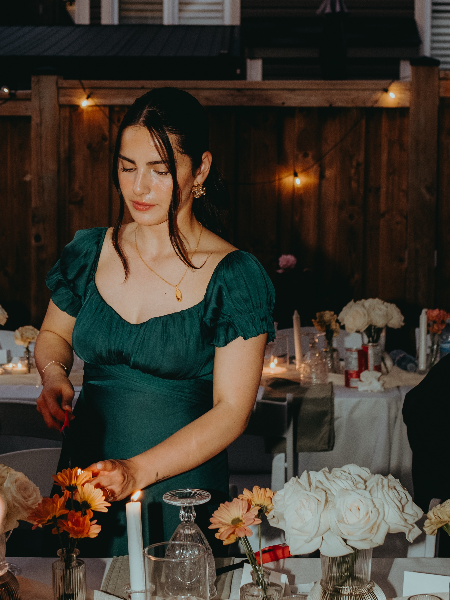

Nora and Ali got married in the backyard of the house that raised one of them. No venue, no ballroom. Just a cedar fence strung with warm bulbs, a gazebo dressed as a ceremony canopy, and a long dinner table running the length of the lawn. The afternoon opened with the nikah, the signing table set in the shade, elders leaning in, pens moving across paper. By evening the whole yard glowed.

I have photographed weddings in Toronto for years, and this is the kind of day I quietly hope for. Intimate scale, real furniture, neighbours who wave over the fence. There is a softness to a backyard wedding that a rented hall cannot manufacture, and it photographs beautifully.

If you are thinking about an intimate backyard wedding in the GTA, this is what the day can look like, and the practical things worth sorting before it does. The tent. The noise rules. The neighbours. And how to time it so the light does the heavy lifting.

## What a backyard wedding actually is

A backyard wedding is exactly what it sounds like, and that is the whole appeal. You get married where you live, or where your family lives, and you soften the space for one evening into something that feels sacred.

**Typical scale:** 20 to 60 guests. Small enough that everyone there means something to you.

**What you provide:** The setting is free, but you bring the rest. A tent or canopy, tables and chairs, lighting, catering, and sometimes a portable washroom for larger counts.

**What you save:** The venue fee, the rigid timeline, and the feeling of borrowing someone else's space.

**What it asks of you:** A little planning around tents, noise, and parking. Nothing hard, but worth doing early.

**Best season:** Late May through September in the GTA. Long evenings, warm light, and a low chance of needing the rain plan.

## A backyard, a nikah, a summer evening

The day started with the nikah. The signing table was set in the shade at the side of the house, elders leaning in, the two of them quiet and a little nervous in the best way. There is no stage at a backyard wedding, no separation between the couple and the people who love them. Everyone is close. The camera just has to stay out of the way and let it happen.

The ceremony itself was under the gazebo, dressed with white florals into a proper canopy. Guests sat on the lawn in rows that did not need to be perfect. The light came through the trees, soft and dappled, the way it only does in a real garden. No uplighting could match it.

Dinner was one long table down the middle of the lawn. The cedar fence behind it was strung with warm bulbs that came up as the sky went down, and around the time the food landed the whole yard turned gold. This is the hour a backyard wedding is built for.

We stole the couple away for a few minutes at golden hour, then again once the lights took over. A backyard at dusk gives you a kind of warmth you cannot rent. The full gallery from their evening is here: [Nora + Ali's backyard wedding](/portfolio/nora-ali/).

## How to plan a backyard wedding in Toronto

The good news: a small backyard wedding asks very little of the City. Here are the few things worth handling early.

**The tent.** This is the one permit question that catches people. The City of Toronto requires a building permit for a tent only when it is larger than 60 square metres, attached to your house, or set within 3 metres of another structure. A modest tent under that size, set out in the open, usually needs no permit at all. Most reputable GTA rental companies know these rules and will tell you if your layout triggers a permit, but the legal responsibility sits with the property owner. If you are renting a large reception tent, confirm with Toronto Building before you book.

**The noise.** Toronto's noise bylaw is complaint-based, so there is no single posted cutoff time. The practical rule that keeps everyone happy: run your main amplified music and dancing before 11 PM, then bring the volume down to low indoor or acoustic sound after that. Outdoor amplified music that neighbours can clearly hear late at night is what draws a bylaw officer.

**The neighbours.** This is the highest-leverage thing you can do, and it costs nothing. Tell the people on either side your date, roughly when the music will run, and where guests will park. Give them a phone number. A neighbour who feels included almost never complains. A surprised one sometimes does.

**Parking.** You cannot reserve street parking without a City permit, and many residential streets are permit-only or time-limited. Tell guests where to park, suggest carpooling or rideshare, and keep rental trucks and catering vans clear of driveways and hydrants.

**Washrooms.** A home bathroom handles a small group fine. Past roughly 40 guests, a clean portable washroom in the yard saves the day and the line at the back door.

**Alcohol.** If you are simply serving drinks to guests at a private home, you generally do not need a permit. You only need a Special Occasion Permit from the AGCO if you are selling alcohol or running a ticketed bar.

A quick honest note: City rules, fire code, and building requirements change, and the details depend on your exact yard. Call 311 or check the City of Toronto site before you finalize tents, music, and guest numbers.

## Timing a backyard wedding around the light

The single best decision you can make is when to start the ceremony, and the answer is almost always tied to sunset.

**Ceremony, two to three hours before sunset.** Soft, even light on the vows, with the harsh overhead sun already past. Nobody is squinting.

**Portraits, right after.** You walk straight from the ceremony into golden hour, the best light of the day, without making guests wait.

**Dinner, as the sun drops.** The string lights start to read on camera, the sky goes warm, and the yard transforms.

**Dancing and lights, after dark.** This is where the bulbs you strung along the fence earn their keep. Warm, intimate, and entirely yours.

We build the whole timeline backward from sunset. Tell us your date and we will tell you the exact hour your ceremony should start.

## What a backyard wedding costs to photograph

A backyard wedding is an [intimate wedding](/intimate-wedding-toronto/), and intimate weddings do not need ten hours of coverage. Most of our backyard couples book a half-day, enough to cover the ceremony, the golden-hour portraits, and the first part of the evening. That keeps the photography budget sensible without missing anything that matters.

We have written a full, honest breakdown of GTA wedding pricing, including what drives the number up and what we charge, here: [what an intimate Toronto wedding costs](/blog/intimate-toronto-wedding-photography-cost/).

## Who a backyard wedding is right for

**You want the day to feel like you.** A rented hall looks like every other wedding held there. Your backyard looks like your life. For couples who value that over grandeur, nothing else competes.

**You are planning small.** Twenty to sixty people, one long table, real conversation. This is the format a backyard is built for.

**You care how the photos feel, not just how they look.** Honest light, personal details, people who actually know each other. A backyard gives a photographer everything and asks for very little.

If a backyard is not an option but you still want intimate, a [City Hall wedding](/blog/toronto-city-hall-wedding-photographer-guide/) gives you the same small, real feeling downtown.

## Frequently asked questions

**Do you need a permit for a backyard wedding in Toronto?**

Usually only for the tent, and only if it is large: bigger than 60 square metres, attached to the house, or within 3 metres of another structure. Smaller tents set in the open typically need no permit. Confirm with Toronto Building before booking a big tent.

**What time does music have to stop?**

Plan to bring amplified music down or off by around 11 PM in a residential area, then switch to low indoor or acoustic sound. Tell your neighbours in advance.

**How many guests can you have?**

There is no fixed legal cap for a private home. Most intimate backyard weddings run 20 to 60. Parking and washrooms are the real limits.

**Is a backyard wedding cheaper than a venue?**

Often, once you account for rentals. The bigger win is a setting that is personal and relaxed, which also happens to photograph beautifully.

**What's the best time of day?**

Start the ceremony two to three hours before sunset. Soft light for vows, golden hour for portraits, string lights for the evening.

## Photograph your backyard wedding

A backyard wedding is small, warm, and completely yours, and it is one of the most beautiful days a photographer can shoot. If you are planning one in the GTA and want someone who will stay close and quiet and let the evening unfold, we would love to talk.

[**View wedding photography packages →**](/services/wedding/)

Or [send a note about your backyard wedding](/contact?venue=backyard-toronto) and tell us your date and what you are planning. We always start with a conversation about the day, the people, and the moments that matter most.

Planning something even smaller? See my [Toronto elopement photography packages](/elopement-photographer-toronto/), from $501.25.
