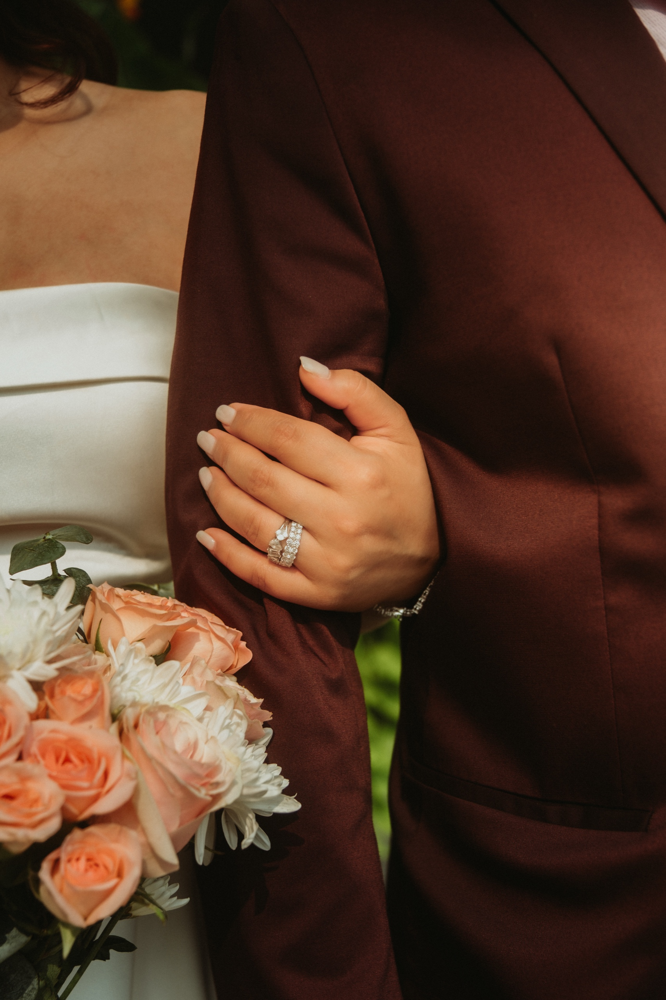
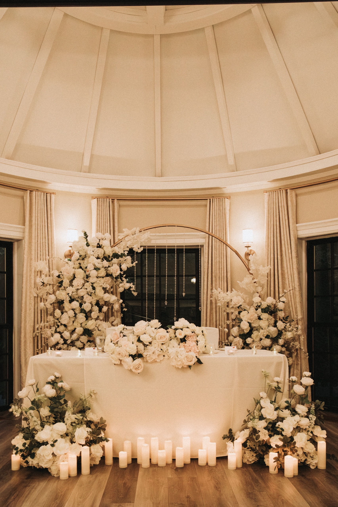
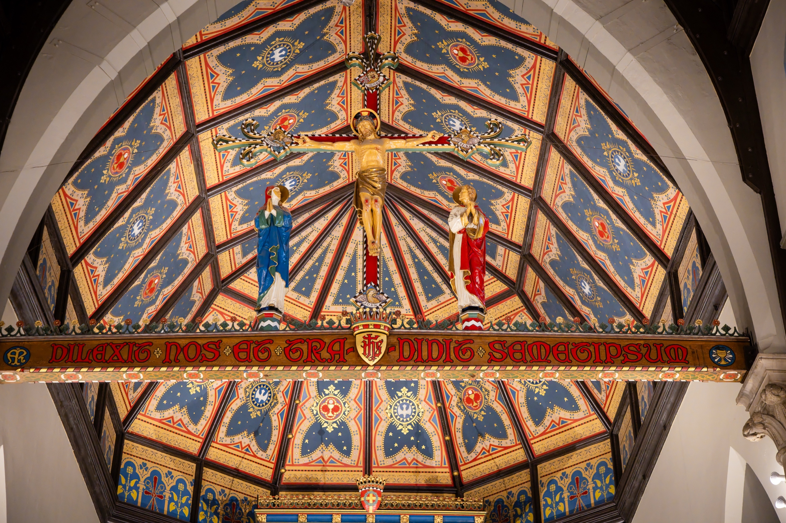

Here is the question every couple actually wants answered, and the one most photographers make you book a call to hear: what does this cost?

We will answer it plainly. This is an honest look at what wedding photography really costs in Toronto and the GTA in 2026, what makes one quote three times another, and exactly what we charge and why. No call required.

A quick note on why this page exists. When we studied the Toronto market, only a handful of photographers showed their prices at all. Most hide them. We think that is backwards. If you are planning a wedding, you deserve to know the number before you spend an evening on a sales call.

## What wedding photography actually costs in the GTA

These are real 2026 ranges for professional photographers in Toronto and the GTA. Not luxury-only rates, and not the rock-bottom marketplace listings. Honest middle.

**A short City Hall or civil ceremony (1 to 2 hours): about $450 to $1,200.**

One photographer, the ceremony, and a short set of portraits nearby. The lower end is solid newer and mid-range professionals. The upper end is more established brands. Some high-end photographers do not offer short coverage at all, because it does not fit a full-day calendar.

**An intimate or backyard wedding (half day, 4 to 6 hours): about $1,200 to $3,000.**

Enough to cover the ceremony, the portraits, and the first part of the celebration. Entry professionals sit at the lower end, established photographers in the middle, premium names above it, sometimes with an engagement session included.

**A full-day wedding (8 to 10 hours): about $2,800 to $5,500 for most professionals.**

Getting ready through reception. Well-known and in-demand photographers run $4,500 to $7,000, often with extras like a second shooter or an album. Luxury and editorial names go past $7,000, sometimes well past it.

The honest summary: if your budget is under $2,000, you are looking at short coverage or a newer photographer. A realistic budget for a full-day professional in the GTA is $3,000 to $5,000 and up.

## What actually drives the price

Price is not really about hours alone. It is time, skill, and what you walk away with. These are the levers.

**Hours of coverage.** The biggest single factor. More hours means more shooting and far more editing afterward. Many photographers set a minimum on peak-season Saturdays.

**A second shooter.** Adding a second photographer usually adds $400 to $1,000 or more. Worth it for large weddings or two simultaneous getting-ready locations. Often unnecessary for intimate days.

**Albums and prints.** A real fine-art album can add several hundred to a couple thousand dollars. Optional, but it is the thing your grandchildren will actually hold.

**An engagement session.** Sometimes bundled into mid and high packages, sometimes a $300 to $800 add-on. It is also the best way to feel comfortable in front of the camera before the day that counts.

**Experience and demand.** Photographers with a deep portfolio, reliable delivery, proper backup systems, and insurance charge more, because their dates are limited and the risk to you is lower. You are paying for the day going right.

**Travel and multiple locations.** Venues outside the core GTA add travel. A day that hops between a hotel, a church, a park, and a hall needs more hours and more planning.

**Season and day of week.** Peak Saturdays from May to October are the most in demand and the most expensive. Off-season and weekday weddings can sometimes book shorter, cheaper coverage.

## How to compare photographers without getting fooled

A few honest tips, even if you do not book us:

**Ask for a full gallery, not the Instagram highlights.** Anyone can post ten great frames. Ask to see every photo from one real wedding, start to finish. That is the true test of consistency.

**Compare what is included, line by line.** Hours, second shooter, engagement session, number of edited images, album, and your rights to use the photos. A cheaper quote with half the inclusions is not actually cheaper.

**Make sure you like the person.** They will be next to you at the most emotional moments of your day. The work matters, but so does the feeling of having them there.

## What we charge, and why

Our pricing is on the site, openly, because you should be able to plan without a phone call.

**Civil ceremony coverage** starts at a fixed rate for a short ceremony and the portraits right after. Built for City Hall and civil weddings.

**Intimate and half-day weddings** sit in the mid range, the right fit for backyard weddings, small church weddings, and intimate celebrations.

**Full-day coverage** scales from there, getting ready through reception.

Every package includes the edited high-resolution gallery, delivered properly.

Two things make our pricing work the way it does. First, we shoot solo by design. One lead photographer, one consistent eye on your whole day, no rotating crew. Where a package includes a second pair of hands for the ceremony, they are briefed and edited by the same eye, so the gallery still reads as one voice. Second, we keep the pricing transparent, because the alternative is a market that hides the number until you are emotionally committed, and we would rather just tell you.

See the current packages on our [services page](/services/wedding/). If you are weighing a smaller wedding, our guides to a [City Hall wedding](/blog/toronto-city-hall-wedding-photographer-guide/) and an [intimate backyard wedding](/blog/intimate-backyard-wedding-toronto/) show what those days actually look like. If an intimate wedding is what you are picturing, here is [how we shoot intimate Toronto weddings](/intimate-wedding-toronto/).

## Frequently asked questions

**How much does a wedding photographer cost in Toronto?**

In 2026, roughly $450 to $1,200 for a short City Hall ceremony, $1,200 to $3,000 for an intimate half-day, and $2,800 to $5,500 for a full day with most established professionals. Premium names go higher.

**Why do some photographers cost so much more?**

Hours, second shooter, albums, engagement session, experience, and demand. Two very different quotes usually mean two very different products, so compare inclusions, not just price.

**How much is a City Hall or civil ceremony photographer?**

About $450 to $1,200 for one to two hours with portraits. Our Civil Ceremony coverage is a fixed package for exactly that.

**Do you need a second shooter?**

Not for most intimate weddings, City Hall ceremonies, or backyard weddings. One experienced photographer keeps the day calm and the cost down.

**Why don't most photographers show their prices?**

To get you on a call first. We list ours openly instead.

## Let's talk about your day

If you want a clear number and a photographer who tells you what things cost up front, you are in the right place. Tell us your date and what you are planning, and we will point you to the coverage that fits.

[**View wedding photography packages →**](/services/wedding/)

Or [send us a note](/contact/#inquiry) and we will start with a real conversation about the day, the people, and the moments that matter most.

Eloping? My [Toronto elopement packages](/elopement-photographer-toronto/) are flat and public: $500 for the civil ceremony, $901.25 for the whole small day.
