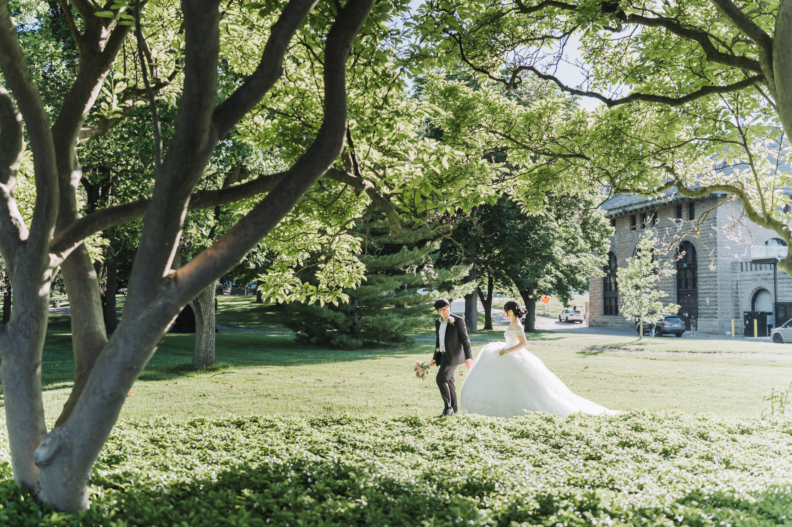
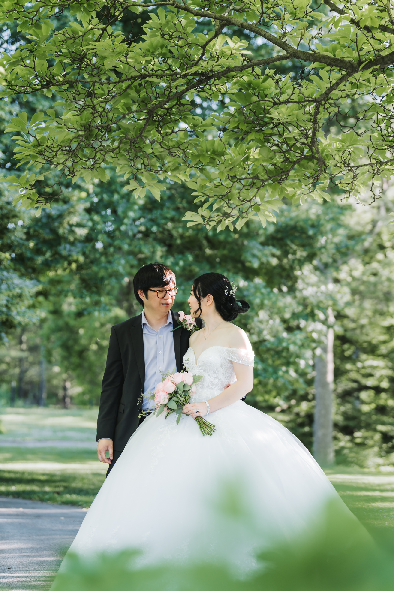
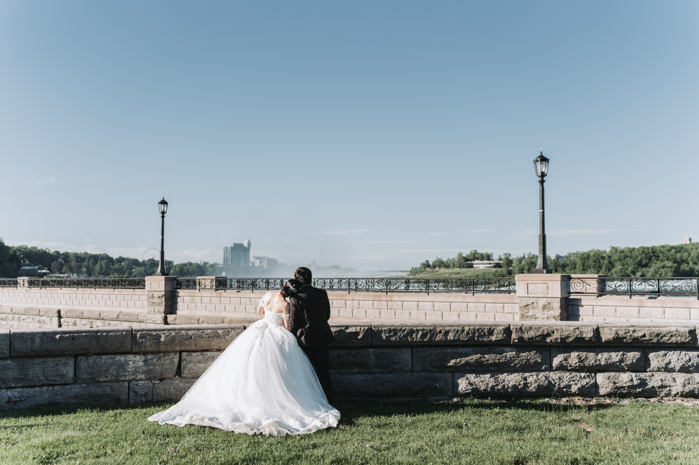

Karen and Micheal were married on a garden path in Niagara Falls, in front of a fish. A very large fish, planted head to tail in living green foliage with one bright orange eye, standing about twice the height of the groom. Their guests sat in white folding chairs on the gravel. The whole ceremony took twenty minutes and it was one of our favourites of the year.

That is the Niagara Parks Botanical Gardens in one paragraph. Ninety nine acres of formal gardens ten minutes north of Horseshoe Falls, free to walk into, open dawn to dusk every day of the year, and almost nobody in the GTA thinks of it as a wedding location.

If you are planning wedding or engagement photos here, this is a photographer's guide to the grounds. What is there, when to come, and the answer to the permit question everybody asks first.

## The short answer on permits

You do not need a permit to take wedding photos here, and it does not cost anything.

Niagara Parks puts it in one sentence in their own wedding FAQ: there is no permit required to take photos in any of their outdoor locations. That covers the Botanical Gardens, and it covers you, your partner, your photographer, and a normal wedding party walking the grounds in a gown.

What you get for free is access, not a reservation. Outdoor photography is first come, first served. You are not given a spot, exclusivity, or any way to move other visitors along. Couples who book a ceremony do pay for exclusive use of their location for a two hour block, so if a ceremony is running you go elsewhere on the property, which across ninety nine acres is never a problem.

The free exemption assumes an ordinary personal shoot. No drone, no sets, no props, nothing that reads as an advertising or fashion production. That work needs a commercial permit, which is a different process with a fee and an insurance requirement.

Two things people confuse with the photo rules:

**Holding your ceremony here is a separate paid booking.** Photography is free. Getting married on the property is a venue rental through Niagara Parks Weddings, with real prices and time blocks. Willow Pond and the Wedding Arbour are the bookable sites on this property. That is what Karen and Micheal arranged.

**Photographing inside the Butterfly Conservatory is also separate.** More on that below.

## The Botanical Gardens at a glance

**Location:** 2565 Niagara Parkway, Niagara Falls, about ten to fifteen minutes north of Horseshoe Falls along the river.

**What it is:** The teaching garden of the Niagara Parks School of Horticulture, founded in 1936. Students design and maintain the displays, which is why the standard is so high. More than eighty thousand annuals are grown on site each year.

**Size:** Ninety nine acres, roughly forty hectares.

**Admission:** Free. Open daily, year round, dawn to dusk.

**Photo permit:** None required for wedding and engagement portraits outdoors.

**Parking:** Paid. Eight dollars an hour in the lots at the Butterfly Conservatory.

**Best light:** Early morning, or the last two hours before sunset. The Shade Garden saves you at midday.

**Best seasons:** Mid June to early July for the roses. Mid to late October for autumn colour. Late April and May for blossom.

## Why it works for photographs

Most outdoor wedding locations in southern Ontario give you one good idea. A lawn, a lake, a facade. The Botanical Gardens gives you eight or nine, all within a walk of each other, and they look nothing alike.

You can shoot a formal, symmetrical, almost European frame in the parterre garden, walk five minutes, and shoot a loose, backlit, full length portrait on a meadow path in the arboretum. Same session, same hour, completely different galleries.

The other thing it has is scale. The arboretum is the largest part of the property and it is mostly mature trees, mown grass and meandering paved walks. You can put a couple a long way from anything and still get real depth behind them. That is rare this close to a tourist town.

And the maintenance is a photographer's dream. This is a horticulture school. The beds are immaculate, the edges are cut, the lawns are clean. You are not spending the edit removing litter and traffic cones.

## The best photo spots

### 1. The Rose Garden

Over two acres, more than 2,400 roses across fifty four rose beds plus thirty one annual display beds. Hybrid tea, floribunda, grandiflora, climbers. It is the strongest romantic backdrop on the property and the reason many couples come.

Timing matters more here than anywhere else. The first flush starts in early June and the strongest window is usually mid June into early July. Roses repeat through the summer but never quite the same way. If the rose garden is the reason you picked this location, book inside that window, and ask Niagara Parks how the beds are looking a few days beforehand.

The paths are narrow. A large wedding party will struggle here on a busy Saturday.

### 2. The arboretum and meadows

The largest section, and our first choice for portraits. Ornamental trees, long grass paths, paved meandering walks, and enough room to actually work. This is where you get privacy, full length frames, backlighting through a tree line, and space for a group of twenty without anybody backing into a hedge.

It is also the best autumn location on the property.

### 3. The formal parterre garden

Geometric, symmetrical bedding, meant to be read along a central axis. Point a camera straight down the middle and the garden composes the picture for you. Good for wide establishing frames, walking shots, and anything you want to feel formal and editorial.

### 4. The Shade Garden

Under mature white pine and spruce. This is the answer to a midday summer wedding. Hard overhead sun turns into soft, even, filtered light, and the wooded depth behind the couple does the rest. If your ceremony is at noon in July, this is where the portraits should happen.

### 5. Crabapple Vista

An avenue Niagara Parks calls one of its most iconic vistas. Best in spring when it is in blossom, and a natural leading line for walking shots at any time of year.

### 6. The Perennial Border

A long border backed by mature white spruce, with something in colour from spring right through to frost. The most reliably photogenic spot on the property if you are coming outside the rose window.

### 7. The Herb Garden

More than five hundred herbs, with a knot garden and a sundial on the central axis. Quieter and greener than the flower beds. Good for close, intimate frames and for the detail shots that hold a gallery together.

## The Butterfly Conservatory

The Conservatory sits on the same property and is a genuinely good rainy day option, but it has its own rules.

Admission is separate and paid. More importantly, a staged wedding photo session inside is a reservation through Niagara Parks Weddings, with rental fees starting at 250 dollars. Buying a ticket and walking in with a gown and a bouquet is not the same thing as booking a session.

There is also a florist rule. Any fresh flowers you bring inside have to be ordered through a Niagara Parks florist, to protect the butterflies and their habitat. Plan for that early, because it affects your bouquet order.

The Conservatory can also be rented as an indoor ceremony space with special permission, capped at around thirty standing guests, in evening blocks.

## Practical notes

**Parking is not free.** This is the one thing couples get wrong. The lots at the Butterfly Conservatory are pay and display at eight dollars an hour. There is a thirty five dollar annual pass for this site and a fifty dollar pass covering most Niagara Parks lots, which is worth it if you are pairing several Parkway locations in one day.

**Dawn to dusk means dawn to dusk.** No night photography with artificial lighting without prior written approval. Plan your golden hour against the actual sunset time, not an hour of margin you do not have.

**No drones.** Recreational drones are not permitted anywhere on Niagara Parks property. This is not a grey area.

**Stay on the paths and the mown grass.** No standing in the beds, no picking, no bending a branch for a better frame. It is a working teaching garden and the plants are the curriculum.

**No confetti.** Do not bring confetti, rice or glitter without written approval. Booked ceremonies are permitted biodegradable flower petals only, and you clean them up afterwards.

**Tripods** are fine outdoors if you keep them compact and out of the walkways. Confirm separately for the Conservatory, where the paths are narrow.

Prices and policies at Niagara Parks change. Everything here was accurate when this was written, but confirm anything that affects your budget or your schedule directly with Niagara Parks Weddings before your date.

## Getting there and what to pair it with

From downtown Toronto it is about 125 to 130 kilometres, an hour and a half to two hours in normal traffic. On a summer Friday or a long weekend, budget two and a half.

The Gardens sit on the Niagara Parkway between the Falls and Niagara on the Lake, which makes them easy to combine:

**[Queen Victoria Park](/location-guide/queen-victoria-park/)** is about eight kilometres south, ten to fifteen minutes. Falls views, mist, formal beds and its own rose garden. Busier and more exposed, but it is the frame everybody recognises. Karen and Micheal finished their day on the Parkway wall above the gorge and it gave the gallery a completely different closing chapter.

**Dufferin Islands** is ten acres of wooded islands and footbridges just south of Horseshoe Falls. Quiet, green, still water. It is also a bookable ceremony site, so you may have to wait your turn.

**The Whirlpool** is five minutes south for gorge walls and rapids, if you want something with real drama in it.

**[Niagara on the Lake](/location-guide/niagara-on-the-lake/)** is twenty minutes north for heritage streets, waterfront and vineyards.

A pairing that works nearly every time: Botanical Gardens in the morning while the light is soft and the crowds are thin, then the Parkway or Queen Victoria Park for the last hour of sun.

## Is it right for your wedding?

The Botanical Gardens suits a particular kind of day. Small to medium, outdoors, unfussy, for couples who care more about being surrounded by something beautiful than about a ballroom. It is a very good answer for an [intimate wedding](/intimate-wedding-toronto/), and a very good answer for a couple who want their photographs to look like a garden in Europe without the flight.

It is a harder answer if you need guaranteed shelter, a large formal reception on site, or total privacy. The gardens stay open to the public even when you have booked a ceremony.

See how it comes together across a whole day in [Karen and Micheal's Botanical Gardens wedding](/blog/niagara-botanical-gardens-wedding-karen-micheal/), or browse their [full gallery](/portfolio/karen-micheal/).

If you are planning a wedding or engagement session in Niagara and want to talk it through, [reach out here](/contact/#inquiry). We travel to Niagara regularly from Toronto and we are happy to help you plan a route through the gardens before you commit to a date.
