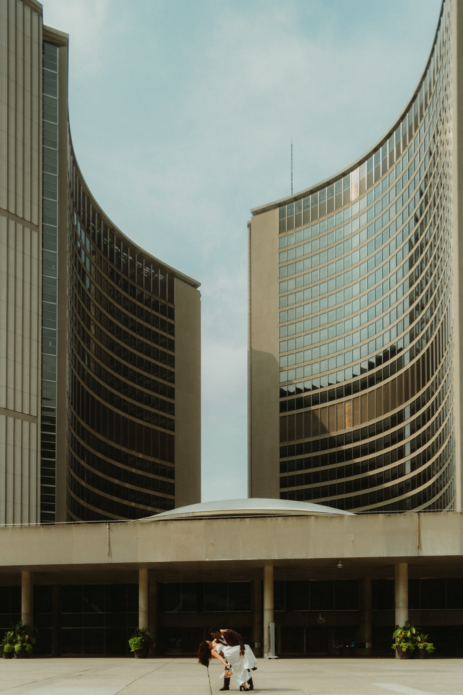
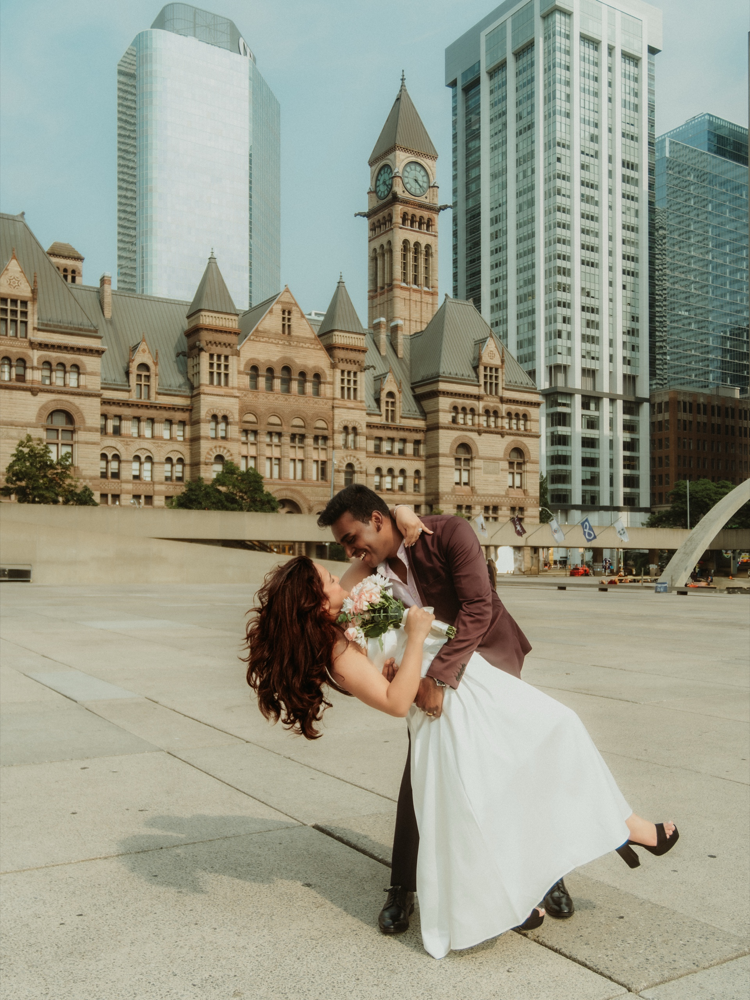

For most of the last century, if you walked into Old City Hall you were probably there for a court date. The sandstone giant at the corner of Queen and Bay spent decades as a courthouse. Judges, lawyers, the full weight of it.

That changed in 2025. The courts moved out, and the City of Toronto did something quietly wonderful with the rooms they left behind. It started marrying people there.

Let me be straight about what I know and what I am reporting. I have photographed City Hall weddings a short walk from here, out on Nathan Phillips Square, with the sandstone of Old City Hall sitting in the background of nearly every frame. I know that plaza and that clock tower by heart. What I have not done yet is photograph a ceremony inside the new Old City Hall chamber, because it is that new. So when I describe the room, I am telling you what the City says, not what I have shot. The light outside, the walk, the way a downtown ceremony actually feels, that part I know cold.

## Old City Hall at a glance

**The building:** Old City Hall, 60 Queen Street West, at Queen and Bay. A sandstone Romanesque landmark designed by E.J. Lennox and opened in 1899. It has been a National Historic Site of Canada since 1984.

**Its past life:** It was Toronto's city hall from 1899 to 1966, then a courthouse for decades. The courts moved out in spring 2025, which is why the rooms are free again.

**The wedding room:** Civil ceremonies take place in the former Council Chamber, the grand room that later served as a courtroom. The City reopened it for weddings in the summer of 2025, the first ceremonies in the building in about forty years.

**The ceremony fee:** The City lists $337.95 including HST for a thirty minute ceremony slot. Confirm the current rate on [toronto.ca](https://www.toronto.ca/explore-enjoy/festivals-events/old-city-hall-events/) before you count on it.

**How to book:** By appointment only. You email marriage@toronto.ca to request a date. Ceremonies are offered on select Thursdays, with more dates added as demand grows.

**The marriage licence:** Separate from the ceremony. An Ontario marriage licence from the City is $180 and is valid for ninety days. You need it in hand before the ceremony, along with two witnesses and government photo ID.

**Guests:** The City has said the building can host up to twelve weddings a day, but it has not published a fixed guest count for the chamber the way it has for its suburban civic centre rooms. Confirm your headcount when you book.

**Photos:** Outside, a small handheld portrait session on the public sidewalks and on Nathan Phillips Square across the street does not need a permit. Tripods, lighting, or a staged production do. Inside the new chamber, ask the City when you book, since the program is brand new.

## What Old City Hall actually is

Old City Hall is not a museum piece dropped downtown for effect. It was the real thing.

E.J. Lennox, the architect who later gave Toronto its Casa Loma, designed it, and it opened on September 18, 1899. For years its clock tower, a little over one hundred metres tall, was the tallest structure in the country. The stone is warm sandstone, carved with the kind of detail nobody budgets for anymore. Out front on Queen Street stands the Cenotaph, the war memorial raised in 1925 for the Torontonians who died in the First World War.

It served as the seat of city government from 1899 until 1966, when the modern New City Hall opened across Bay Street and took over. After that, Old City Hall became a courthouse and stayed one for decades. In the spring of 2025 the courts finally moved to a new building, and the grand old rooms went quiet. The City has been working out what to do with the place ever since, and weddings are one of the first answers.

## The room you get married in

Here is the part I am reporting rather than remembering.

The City holds the ceremonies in the former Council Chamber, the room where councillors once argued and where, in the courthouse years, a courtroom sat. It is grand in the way rooms from 1899 are grand, tall and serious and full of old wood and stone. The ceremonies are civil, meaning not religious, and they are run by City staff officiants appointed by the City Clerk, the same office that runs Toronto's other wedding chambers.

Because this is so new, treat the fine details as things to confirm rather than promises. Ask about the room, the guest count, and photography when you email to book. I would rather you hear the current answer from the City than take an old number from a blog, including this one.

## How to book a wedding at Old City Hall

The route is different from the online booking flow at the suburban civic centres. For Old City Hall, you go to the City directly.

**1. Get your marriage licence first.** An Ontario marriage licence from the City is $180, and it is valid for ninety days. You apply with two pieces of government photo ID each, and if either of you was married before, proof of the divorce or a death certificate. Do not get it too early or it will expire before the day.

**2. Email marriage@toronto.ca to ask for an Old City Hall date.** Ceremonies are offered by appointment on select Thursdays, and the City has been adding dates as more couples ask. The published fee is $337.95 including HST for a thirty minute slot. Confirm it when you write.

**3. Bring two witnesses.** Ontario law needs two people, eighteen or older, to witness and sign the register. They can be anyone you trust, and they do not need to be Canadian residents.

**4. Show up ready.** Bring the licence, bring the witnesses, bring the rings. The ceremony itself is short and warm, the way civil ceremonies are.

## Old City Hall or New City Hall? They are not the same

This confuses almost everyone, so let me settle it.

There are two city halls facing each other across Bay Street, and they look nothing alike.

**New City Hall** is the modern one at 100 Queen Street West, the two curved concrete towers with the saucer shaped council chamber between them, opened in 1965. Its Wedding Chamber has been marrying couples for years. It is a shorter ceremony, holds about twenty two people, and the fee runs around $325. I wrote a full guide to it, so if that is the building you mean, start with my [Toronto City Hall wedding guide](/blog/toronto-city-hall-wedding-photographer-guide/).

**Old City Hall** is the sandstone one at 60 Queen Street West, the clock tower across the street. This is the new option, the thirty minute ceremony in the former Council Chamber.

The lovely part is that they are forty steps apart. Whichever building you marry in, you can get both looks in your photos, the clean modern towers and the carved heritage stone, without moving the car.

## Where I would photograph an Old City Hall wedding

This is the ground I know. The blocks around both city halls make the best compact portrait loop downtown, and I have walked it many times.

Old City Hall itself is the anchor. The sandstone facade, the arched windows, the grand steps, the clock tower overhead. The stone goes warm and golden in late morning and early afternoon light, and the public sidewalk and forecourt out front are fine for a small party.

Across Bay Street is Nathan Phillips Square, the open plaza in front of New City Hall, with the curved towers and the TORONTO sign. Five minutes west on Queen is Osgoode Hall, all neoclassical columns and famous iron gates, and a little further sits the Financial District for a glass and bronze finish. You can walk the whole loop in under an hour, and I break down each stop in my [Toronto City Hall wedding guide](/blog/toronto-city-hall-wedding-photographer-guide/). Since Old City Hall ceremonies fall on Thursdays around midday, the light on that sandstone is usually kind, and the plaza is calmer than a weekend.

## The rules on photography

Outside is simple. For a small wedding party walking around with a handheld camera, no permit is needed on the public sidewalks or on Nathan Phillips Square. You only need a City photography permit if you bring tripods, lighting stands, or stage a larger production. Osgoode Hall is the exception, since it belongs to the Law Society of Ontario rather than the City, so confirm their rules before you plan portraits on those grounds.

Inside the new Old City Hall chamber, I would ask the City directly when you book. Photography during a booked ceremony is normal at the City's other chambers, but this program is new enough that I would rather you get the current answer than assume.

## What it costs, plainly

Three separate things, and it helps to see them apart.

- **Marriage licence:** $180, valid ninety days.
- **Ceremony at Old City Hall:** $337.95 including HST for a thirty minute slot, per the City. Confirm before you book.
- **Photographer:** separate. My civil ceremony coverage is a fixed package that includes the ceremony and the portraits afterward. You can see it on my [civil ceremony page](/services/civil-ceremony/).

No hall rental, no catering minimum, no twelve hour day. That is the appeal.

## Who this is for

If you want to be married without staging a production, and you love the idea of doing it inside a real piece of Toronto history, Old City Hall is hard to beat. It suits small groups, short ceremonies, and couples who want the city itself in their photos. If your plan is even quieter, just the two of you and the paperwork, that is an [elopement](/elopement-photographer-toronto/), and I photograph those year round too.

## Frequently asked questions

**Can you get married at Old City Hall in Toronto?**

Yes. After the courts moved out in spring 2025, the City began offering civil ceremonies inside Old City Hall, in the former Council Chamber, by appointment on select Thursdays. You book by emailing marriage@toronto.ca. It is the first time couples have married in the building in about forty years, so confirm the current details on toronto.ca.

**How much does an Old City Hall wedding cost?**

The City lists the ceremony at $337.95 including HST for a thirty minute slot. Your Ontario marriage licence is a separate $180 and is valid ninety days. Your photographer is a separate cost again. Fees can change, so confirm the ceremony rate on toronto.ca.

**Is Old City Hall the same as Toronto City Hall?**

No. Old City Hall is the 1899 sandstone building with the clock tower at 60 Queen Street West. New City Hall is the modern building with the two curved towers at 100 Queen Street West. They face each other across Bay Street.

**How do you book?**

Email marriage@toronto.ca to request a date. Get your marriage licence first and line up two witnesses who are eighteen or older. The City has not published a fixed guest count for the chamber, so confirm your headcount when you write.

## Photograph your Old City Hall wedding

Old City Hall is one of the most beautiful rooms in the city, and for the first time in a generation you can be married inside it. If you are planning a ceremony here, or downtown at all, I would love to hear about it.

[**See civil ceremony photography →**](/services/civil-ceremony/)

Or [send a note about your Old City Hall wedding](/contact/?venue=old-city-hall) with your date and what you are picturing. I always start with a conversation about the day and the people in it.
