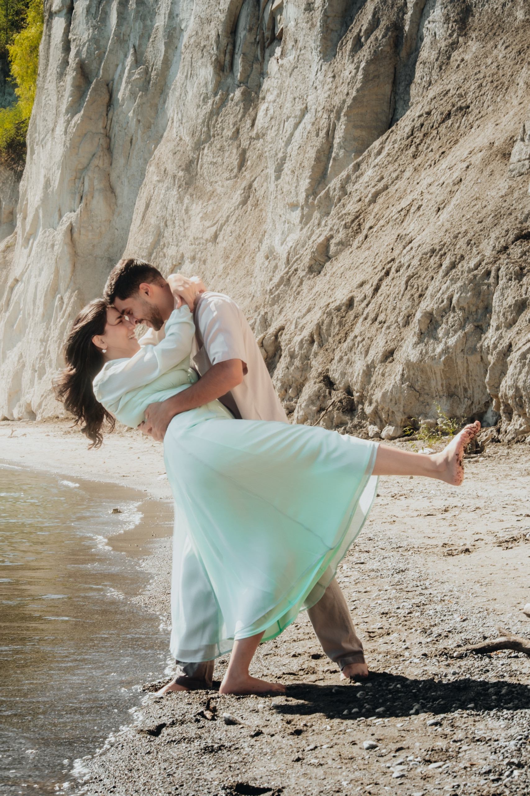
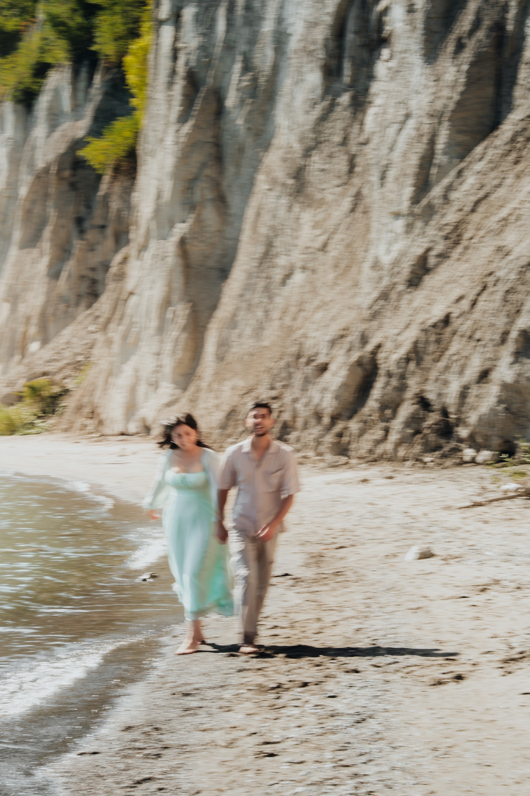
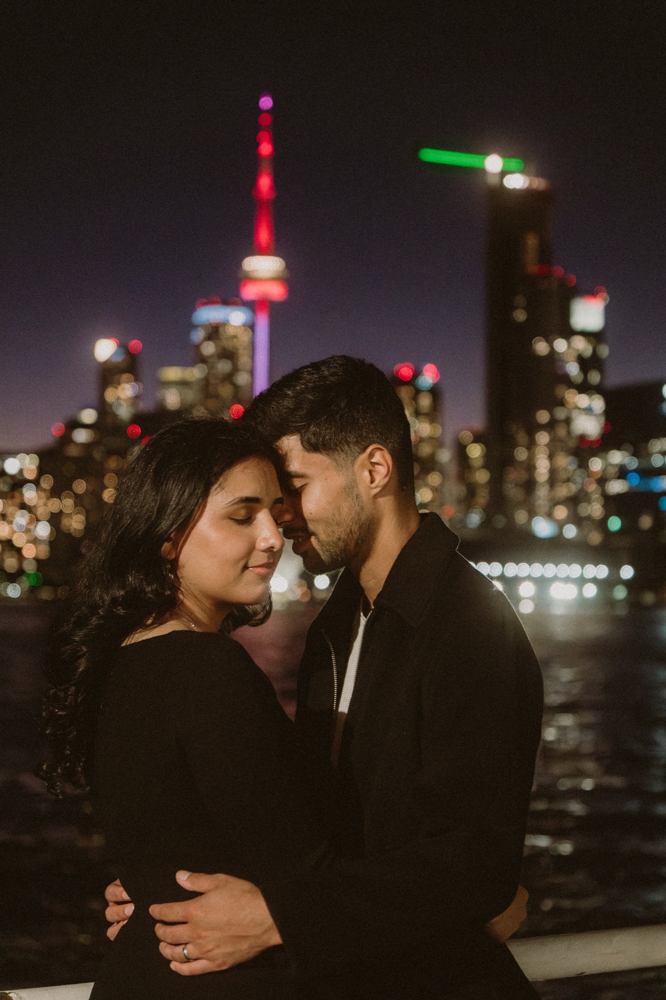

There is a stretch of sand at the bottom of Brimley Road where Toronto stops looking like Toronto. White clay cliffs stand a hundred feet over the beach, the lake runs flat to the horizon, and the city you drove out of twenty minutes ago is nowhere in the frame. This is Bluffer's Park, the beach below the Scarborough Bluffs, and it is the closest thing the GTA has to a destination coastline.

I photographed Swati and Saksham here in late September, the first stop of a three location day that ended under the downtown skyline. This guide is everything I have learned shooting pre-wedding sessions at the Bluffs, plus the frames from their session to show you what the place actually gives you.

## The Bluffs at a glance

**Location:** Bluffer's Park, at the bottom of Brimley Road, Scarborough.

**What it is:** A sandy public beach below the white clay cliffs of the Scarborough Bluffs, with marina docks to the west and a wilder spit of sand to the east.

**Drive time:** 30 to 40 minutes from downtown Toronto.

**Parking:** Paid lot at lake level. Nearly empty at sunrise, can fill by mid morning on summer weekends.

**Photo permit:** Not needed for a small session. It is public parkland.

**Walking level:** Flat sand from the lot, but the best frames are at the waterline, so plan for soft, damp sand and bring a towel for shoes.

**Best light:** Sunrise, when the cliffs go from blue to peach in about fifteen minutes. Golden hour also works, the beach faces west.

## Why the Bluffs work for pre-wedding photos

The cliffs solve the hardest problem in Toronto photography, which is scale. Stand a couple at the waterline and the cliff wall rises behind them like a backdrop the city built and forgot about. Wide frames feel cinematic without trying. Tight frames pick up the texture of the clay and the soft bounce of light coming off all that white stone.

The water does the rest. Swati and Saksham went straight in, no hesitation. He carried her along the shoreline, she kicked her heel up mid kiss, and the dips at the waterline turned into the heart of the gallery. The henna on her feet showed every time the dress fanned out, the kind of detail you only get when a couple decides the lake is part of the session instead of something to stay dry from.

It is also one of the best places in the city for motion. The long empty beach gives a couple room to actually walk, chase, and dance, so slow shutter frames pick up real movement instead of a posed shuffle.

## How their session ran

We met at the beach in the afternoon and worked the waterline first, while the light was still high and the cliffs were bright. Lifts, dips, a twirl, a slow shutter walk, and the quiet frames in between. About an hour in, sand in everyone's shoes, we called it and drove fifteen minutes north to the R.C. Harris Water Treatment Plant, where the red gown came out and the whole session changed register. Art deco stone, a lace train pouring off a plinth, golden hour on the lake.

After dark we finished at Polson Pier, across the harbour from downtown. Black outfits, the CN Tower glowing red, and the last frame of the night, the two of them forehead to forehead with the tower between them.

You can see the full set in [Swati and Saksham's gallery](/portfolio/swati-saksham/).

## Practical notes before you book

Wear shoes you can walk in and save the formal pair for the sand. Expect wind off the lake, which is a gift for hair and fabric and a small tax on umbrellas. If you want the beach to yourselves, book sunrise. If you want the warm light on the cliffs at the end of the day, book the last two hours before sunset and accept some company on the sand.

The Bluffs also pair naturally with other east end locations. R.C. Harris is fifteen minutes away and covered in its own guide, [RC Harris Engagement Photos: A Toronto Location Guide](/blog/rc-harris-engagement-photos-toronto/). The full list of places I shoot is in the [location guide](/location-guide/), including the [Scarborough Bluffs entry](/location-guide/scarborough-bluffs/).

If a beach and cliff session sounds like your kind of day, [get in touch](/contact/) and tell me what you are planning. The [pre-wedding packages](/services/pre-wedding/) cover everything from a two hour single location session to the full three location day Swati and Saksham ran.
