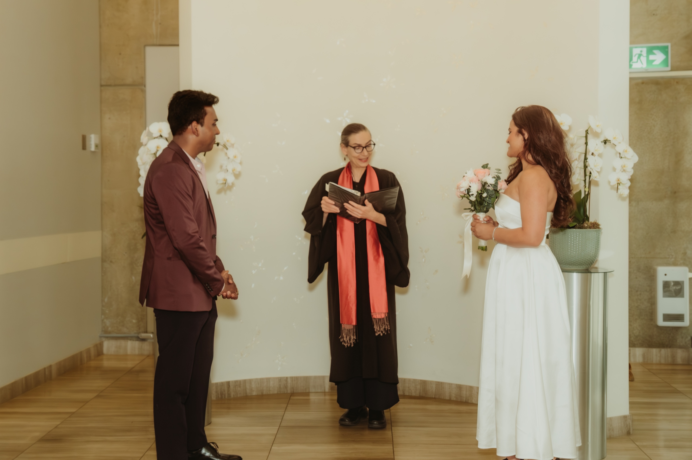
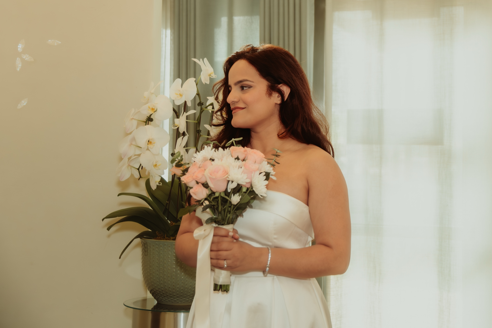
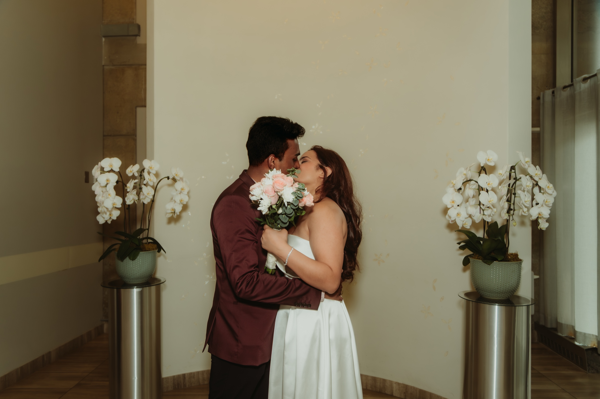
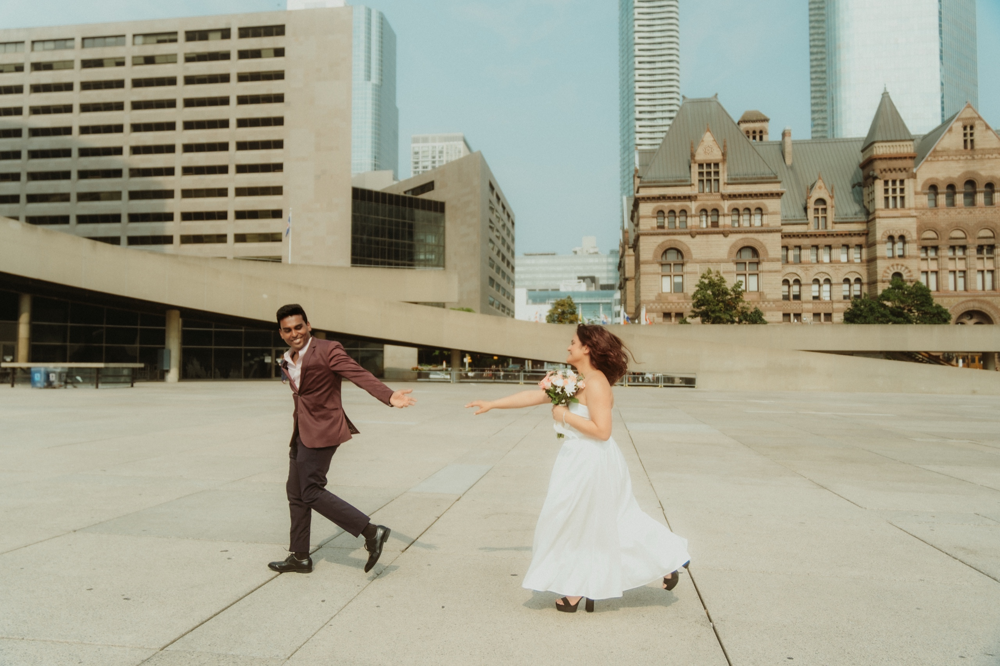
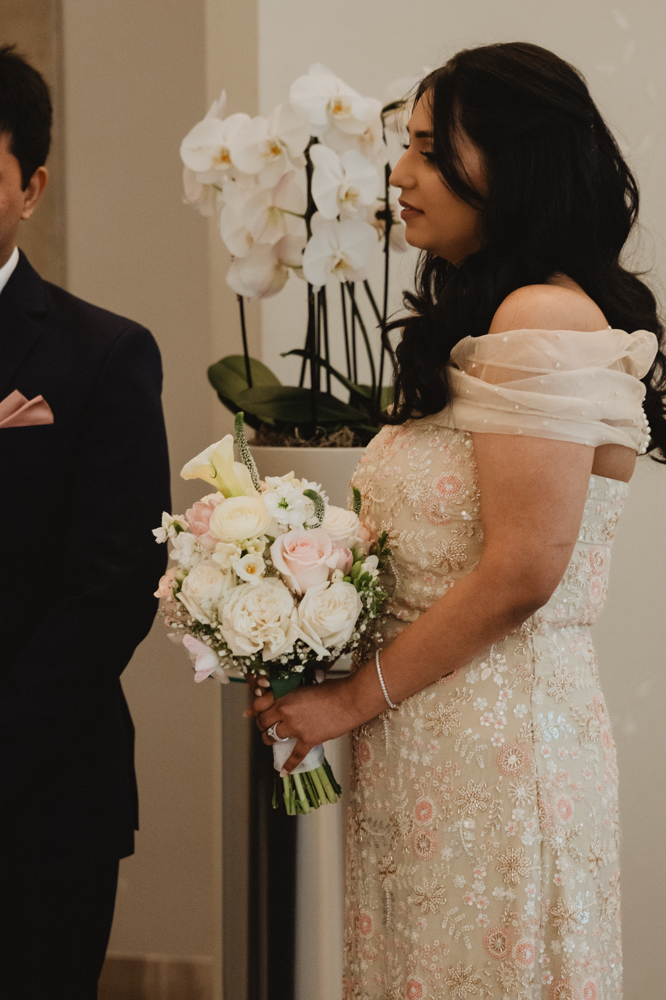
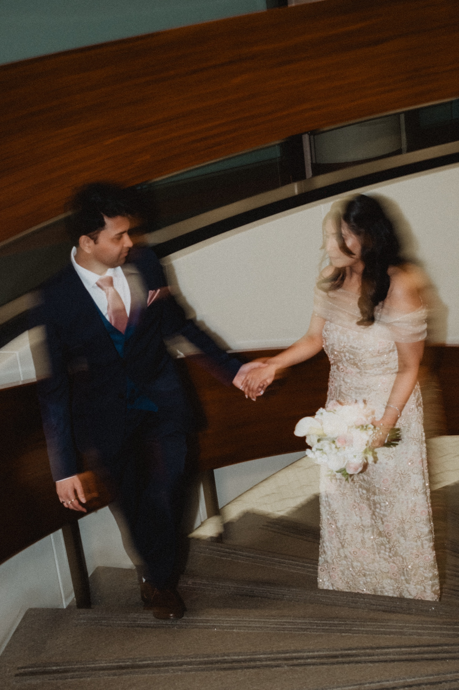

Anushka and Anthony did not want a production. They wanted to get married. A Tuesday at Toronto City Hall, an officiant with a red scarf, white orchids on either side of the aisle, and the two of them saying the words that mattered. The ceremony ran about fifteen minutes. Then we stepped outside onto Nathan Phillips Square, the curved towers rising overhead, Old City Hall sitting in the background like a postcard, and for forty-five minutes the whole plaza belonged to them.

That is the quiet appeal of a City Hall wedding. No twelve-hour timeline, no hall to fill, no second mortgage. Just the legal ceremony, the people who matter, and a downtown core full of architecture that photographs beautifully.

If you are thinking about getting married at Toronto City Hall, this is everything we wish someone had laid out plainly before the day. How the ceremony actually works. The one thing almost everyone gets wrong about which building you are in. Where to take portraits the moment you walk out. And what it really costs, from a photographer who has shot these mornings and knows the loop by heart.

## Toronto City Hall at a glance

**Where the ceremony happens:** The Wedding Chamber inside New City Hall, 100 Queen Street West, on Nathan Phillips Square. It sits in the East Tower on the third floor.

**The building:** New City Hall is the modern landmark with the two curved towers and the saucer-shaped council chamber between them, designed by Viljo Revell and opened in 1965.

**Guest capacity:** About 22 people total, including the couple and two witnesses. Seating for roughly 15, standing room for a few more.

**What you need:** An Ontario marriage licence issued within the last 90 days, two witnesses who are 18 or older, and government photo ID.

**Cost:** Roughly $160 for the marriage licence and around $325 including tax for the City Hall ceremony. Confirm current rates on toronto.ca, since the City updates them.

**Walking level:** Low. Everything is flat downtown sidewalk. The portrait loop is a few blocks at most.

**Best light for portraits:** Late morning through mid afternoon on Nathan Phillips Square and at Old City Hall, when the sandstone glows and the plaza is not yet in deep shadow.

**Photo permit:** Not needed for a small walking portrait session on Nathan Phillips Square. Osgoode Hall is separate property with its own rules.

## The one thing couples get wrong: Old City Hall vs New City Hall

This trips up almost everyone, so it is worth thirty seconds.

There are two City Halls facing each other across Bay Street, and they look nothing alike.

**New City Hall** is the modern one with the two curved towers. This is where the Wedding Chamber is. This is where your civil ceremony actually takes place. The address is 100 Queen Street West, and the doors open onto Nathan Phillips Square.

**Old City Hall** is the Romanesque Revival building beside it: heavy sandstone, a tall clock tower, arched windows, the kind of stone that looks like it was carved for a movie. For decades it served as a courthouse. The City has recently reopened a separate chamber inside it for civil ceremonies as well, but when most couples picture a City Hall wedding, they are picturing the ceremony in New City Hall and the photos against Old City Hall.

Here is why this matters for your day: the modern towers of New City Hall and the carved sandstone of Old City Hall are two completely different looks, and they are forty steps apart. You get clean modern architecture and old-world heritage stone in the same set of portraits, without moving the car. We use both in nearly every City Hall session.

## A real City Hall wedding

Anushka held a bouquet of pink roses and white daisies. Anthony wore a burgundy blazer and could not stop smiling, tugging at the lapels between moments. The Wedding Chamber is a small, calm room with white orchids flanking the aisle and soft daylight coming in, and it does not ask for much. We stayed close and shot quiet, because a fifteen-minute ceremony with just the two of them does not need direction. It needs a witness.

The whole thing is over fast. The vows, the ring exchange, the first kiss. When it is this intimate, there is nowhere to hide, and that is exactly what makes the frames land. Anushka closing her eyes as Anthony slid the ring on. The bouquet pressed between them during the kiss. You do not get those twice, so we shoot the small weddings the same way we shoot the big ones, watching everything.

Then we went outside. The curved towers of New City Hall framed them from above, Old City Hall anchored the background, and they had the plaza to themselves for the better part of an hour. They walked, they laughed, Anthony pulled Anushka into a spin. A civil ceremony carries the same weight as any grand affair. Sometimes more.

The full gallery from their morning is here: [Anushka + Anthony at Toronto City Hall](/portfolio/anushka-anthony/).

## How the civil ceremony actually works

The part most guides skip. Here is the real sequence.

**1. Get your marriage licence first.** This is separate from the ceremony. Apply for an Ontario marriage licence from the City with valid photo ID for both of you. If either of you was married before, bring proof of divorce or a death certificate for the former spouse. The licence costs around $160 and is valid for 90 days, so do not get it too early.

**2. Book the ceremony.** Once you have the licence sorted, reserve a time slot with the City's wedding chambers, usually online or by phone, and pay the ceremony fee at booking. Weekday slots are the ones couples want and they fill up, especially late morning and Fridays. Reserve your date as early as you can.

**3. Bring two witnesses.** Ontario law requires two witnesses, age 18 or older, present at the ceremony to sign the register. They can be family, friends, or anyone you trust. They do not need to be Canadian residents.

**4. Show up a little early.** The chamber runs on a schedule because there are other couples that day. Arrive fifteen minutes ahead, find the room in the East Tower, and let the officiant know your photographer is with you.

**5. The ceremony itself.** Ten to fifteen minutes. Vows, rings, the kiss, signatures. Quick, warm, and real.

On the photographer question: you are absolutely allowed to bring your own. Photography during your booked slot is part of the booking, with no separate permit required. We check in with the officiant on arrival, ask about flash, and work from the side and back so we never block the aisle. It is the same way we shoot any intimate ceremony, just in a smaller room.

## Where to shoot after: the downtown portrait loop

This is where a City Hall wedding earns its reputation. Within a five to ten minute walk you have four distinct backdrops, and you can cover them all on foot.

### 1. Nathan Phillips Square

Step out the front doors and you are already there. The curved towers of New City Hall make a clean modern frame from below. The 3D TORONTO sign by the reflecting pool is the obvious shot, and worth one or two frames, though it draws a crowd. We prefer the concrete arches over the pool and the open plaza, where there is room to walk and laugh without an audience. For a small wedding party just taking portraits, no permit is needed. You only need a City permit if you are bringing tripods, lights, or a full production.

### 2. Old City Hall

Cross Bay Street to the sandstone. Old City Hall gives you carved stone, arched windows, a grand staircase, and the clock tower overhead. It is the heritage counterweight to the modern towers behind you, and the warm stone photographs beautifully in late morning and early afternoon light. The public sidewalks and forecourt are fine for a small party.

### 3. Osgoode Hall

A five minute walk west on Queen Street brings you to Osgoode Hall, and this is our favourite stop on the loop. Neoclassical columns, a grand facade, manicured gardens, and the famous wrought-iron gates along Queen that were built to keep cattle out. It is the quiet, green chapter after the busy plaza.

One important note: Osgoode Hall belongs to the Law Society of Ontario, not the City. The grounds have their own photography rules, and access is sometimes limited during construction or court events. Confirm current access with the Law Society before you build it into your plan, because a City permit does not cover it. We photographed Sonia and Achyut on this exact two-building arc, from Old City Hall to Osgoode, in a single relaxed afternoon. The full set is here: [Sonia + Achyut, Old City Hall and Osgoode Hall](/portfolio/sonia-achyut/).

### 4. The Financial District

If you want one more look, walk south a few minutes toward King and Bay. Bronze and glass towers, deep canyon shadows, clean lines. Best outside of rush hour, and best on public sidewalks, since the indoor lobbies are private. It is the most editorial backdrop of the four, and a strong place to finish.

## When to time your City Hall wedding

**Late morning (10 AM to noon):** Our recommended window. The chamber light is soft, Nathan Phillips Square is not yet crowded, and Old City Hall's sandstone is catching warm light. You finish portraits before the lunch rush fills the plaza.

**Early afternoon (1 PM to 3 PM):** Still good. The square gets busier, but Osgoode Hall and the Financial District stay calm, and the heritage stone holds its glow.

**Late afternoon:** New City Hall's towers start throwing long shadows across the square. Workable, but the plaza loses its even light. Lean on Old City Hall and the Financial District instead.

**Winter:** A City Hall wedding is one of the few Toronto weddings that works beautifully in the cold, because almost everything is a short walk and the architecture does not depend on greenery. Bring a warm coat for the walk between buildings and we will keep the outdoor portion tight.

## What couples should plan for

**The two-fee thing.** The licence and the ceremony are billed separately. Budget for both, and get the licence within 90 days of the wedding so it does not expire.

**Witnesses.** You need two, and they need to be there in person to sign. Line them up early so it is not a day-of scramble.

**Getting there.** City Hall is right on the subway at Queen Station, a short walk from Osgoode Station, and surrounded by Green P parking if you drive. There is no dedicated wedding lot, so transit is often easier than parking downtown.

**Weather and backup.** Most of the portrait loop is outdoors. If it rains, the covered podium areas of Nathan Phillips Square, the arches, and the building entrances give us dry frames. A City Hall day is rarely rained out, it just moves under cover.

**Crowds.** Nathan Phillips Square is a busy public space. We work around it by favouring the quieter corners and timing the loop for late morning. It is never a problem, just something to expect.

**Accessibility.** The whole loop is flat and walkable, with elevator access in the building. If anyone in your group has mobility needs, the route works.

## Who a City Hall wedding is right for

**You want to be married, not stage a production.** If the legal ceremony and your closest people are the whole point, City Hall delivers exactly that and nothing you do not want.

**You are planning small.** Twenty guests or fewer, a short ceremony, an hour of portraits. This is the format City Hall is built for.

**You love the city itself.** Couples who want Toronto in their photos, the real downtown, modern and heritage in the same frame, tend to fall for this loop. It is a love letter to the city as much as a wedding.

**You might do more later.** Plenty of couples marry at City Hall now and host a larger celebration down the road. A City Hall wedding does not close any doors. It just gets the important part done, beautifully.

If a church or a heritage estate is more your speed, that is a different day. You can see how that looks in our [Hamilton church and Dundurn Castle wedding](/blog/hamilton-wedding-st-patricks-dundurn-roxanne-justin/), or pair a downtown ceremony with the [best Toronto pre-wedding locations](/blog/best-toronto-pre-wedding-locations/) for a separate portrait session.

## Frequently asked questions

**How much does it cost to get married at Toronto City Hall?**

Budget for two separate fees. An Ontario marriage licence is around $160 and is valid for 90 days. The civil ceremony in the Wedding Chamber is roughly $325 including tax for a short ten to fifteen minute ceremony. Fees are set by the City and change, so confirm current rates on toronto.ca before you book. Our Civil Ceremony coverage is a separate fixed package that includes the ceremony and the portraits afterward. See our [services page](/services/civil-ceremony/) for current options.

**Is the ceremony at Old City Hall or New City Hall?**

The classic Wedding Chamber is inside New City Hall at 100 Queen Street West, the modern building with the two curved towers. Old City Hall, the sandstone clock tower across Bay Street, was a courthouse for decades and has recently reopened a separate chamber for civil ceremonies too. Most couples mean New City Hall, then use Old City Hall's facade for photos.

**How many guests can you bring to a City Hall ceremony?**

The Wedding Chamber holds about 22 people total, including the two of you and your two witnesses. If your guest list is larger than 20, the chamber is not the right room.

**Can you bring your own photographer into the Wedding Chamber?**

Yes. Photography during your booked ceremony is part of the booking and needs no separate permit. We check in with the officiant, ask about flash, and shoot from the side so we never block the aisle.

**Do you need a permit to take wedding photos on Nathan Phillips Square?**

For a small wedding party walking around with a handheld camera, no. You only need a City permit for tripods, lighting, or a larger staged shoot. Osgoode Hall is separate property owned by the Law Society of Ontario, so confirm their rules directly.

**Where do you take photos after a City Hall wedding?**

A tight loop: Nathan Phillips Square, then Old City Hall's sandstone facade, then the gardens and iron gates of Osgoode Hall, then the Financial District. All within a ten minute walk.

## Photograph your City Hall wedding

A City Hall wedding is small, fast, and completely real, and the downtown core gives it more beautiful backdrops than almost any venue in the city. If you are planning a ceremony here and want a photographer who already knows the chamber, the loop, and the light, we would love to talk.

[**View wedding photography packages →**](/services/civil-ceremony/)

Or [send a note about your City Hall wedding](/contact?venue=toronto-city-hall) and tell us your date and what you are planning. We always start with a conversation about the day, the people, and the moments that matter most.

Planning a small ceremony beyond City Hall? I photograph [intimate Toronto weddings](/intimate-wedding-toronto/) year round.
