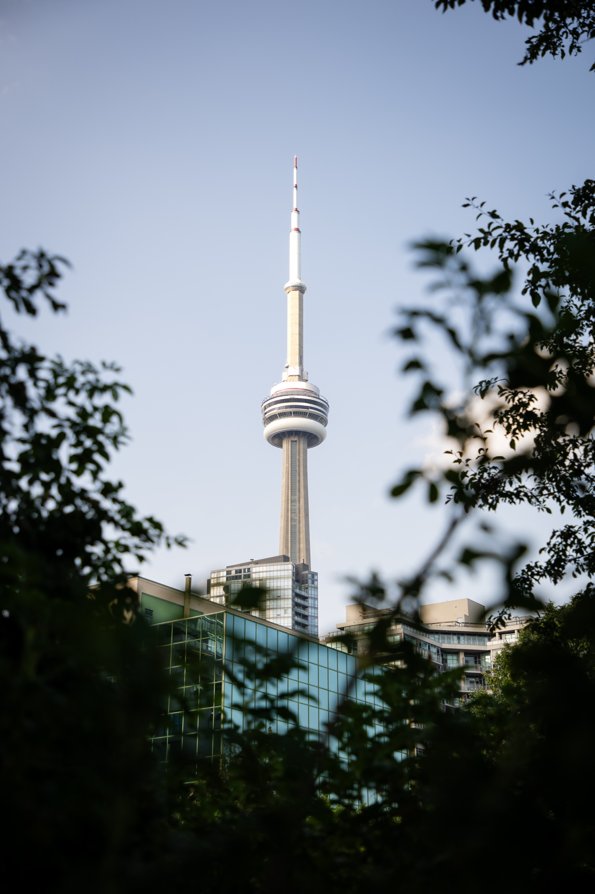
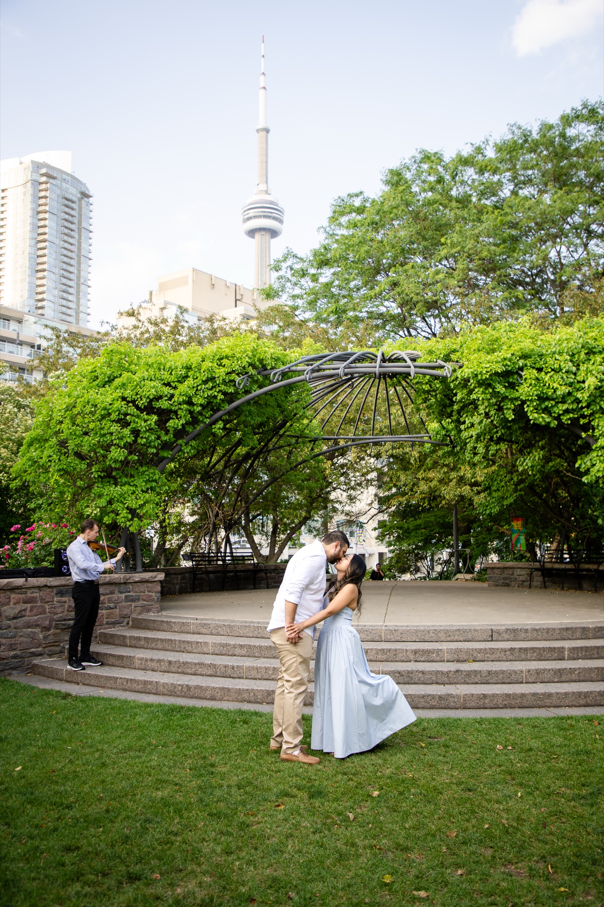
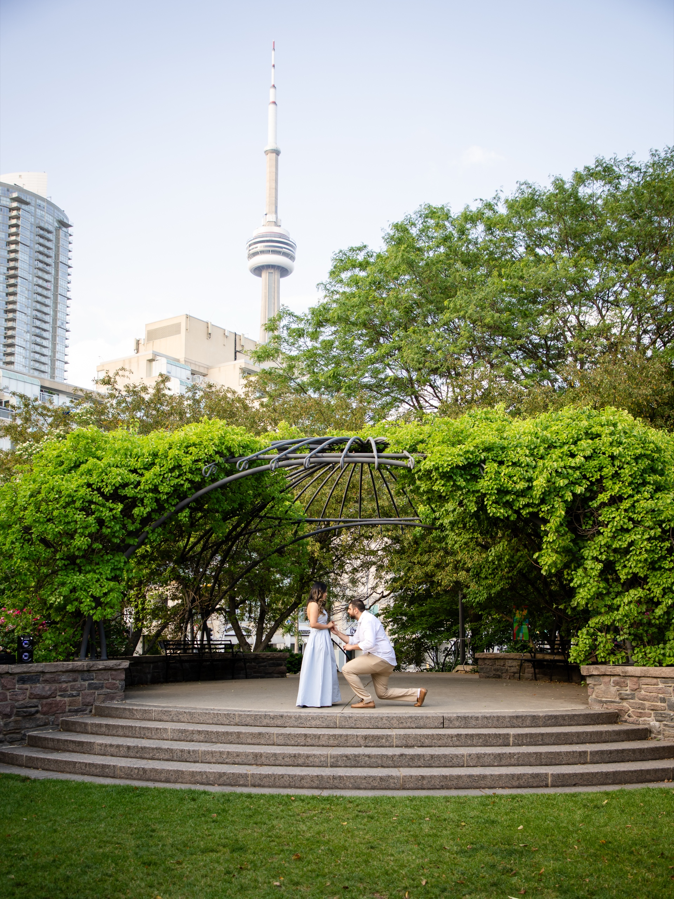
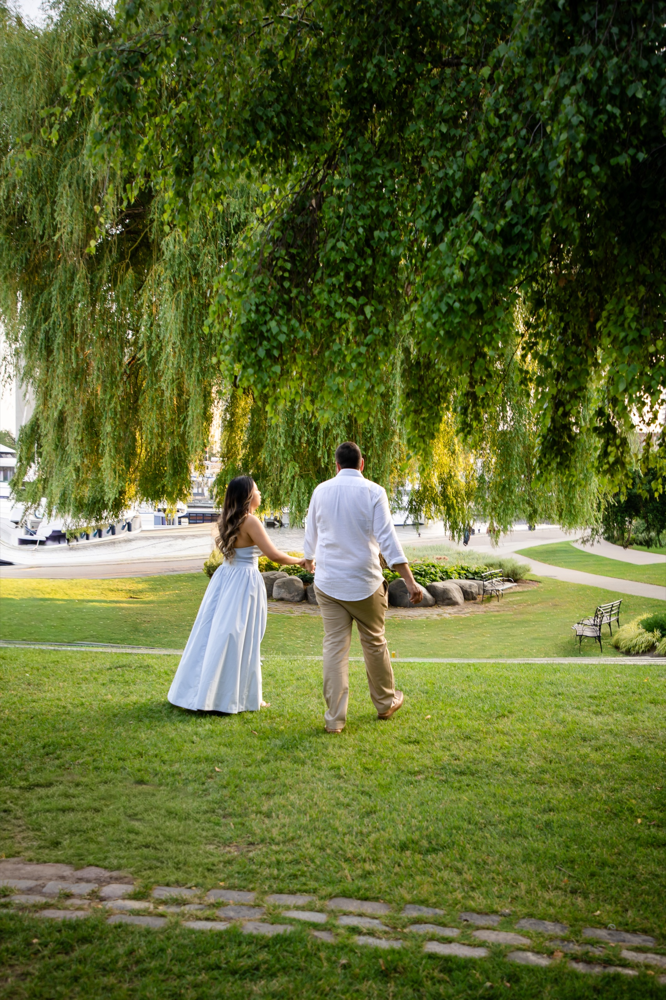
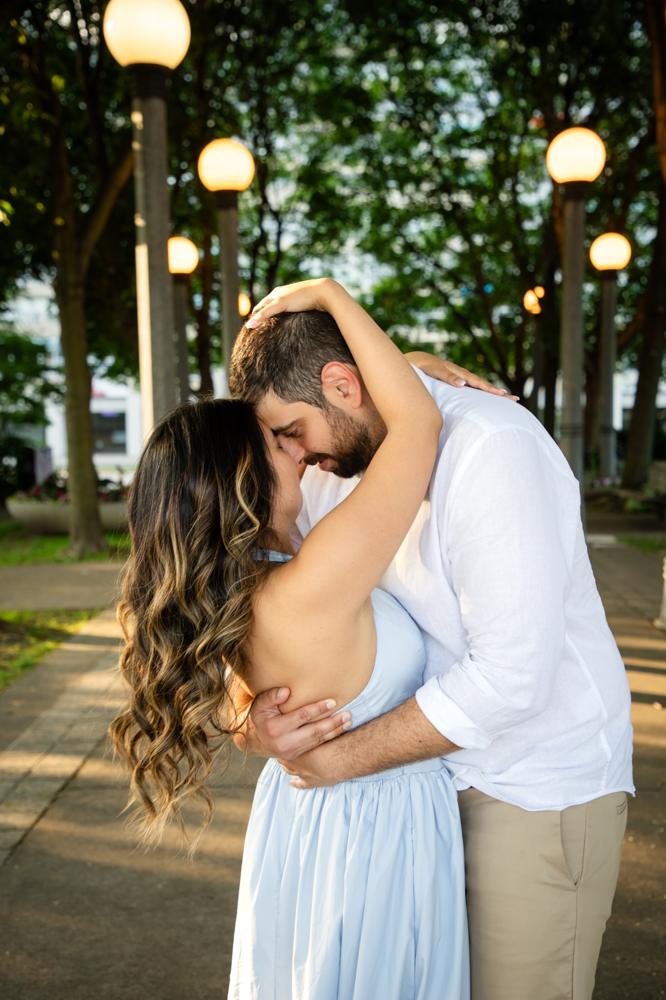
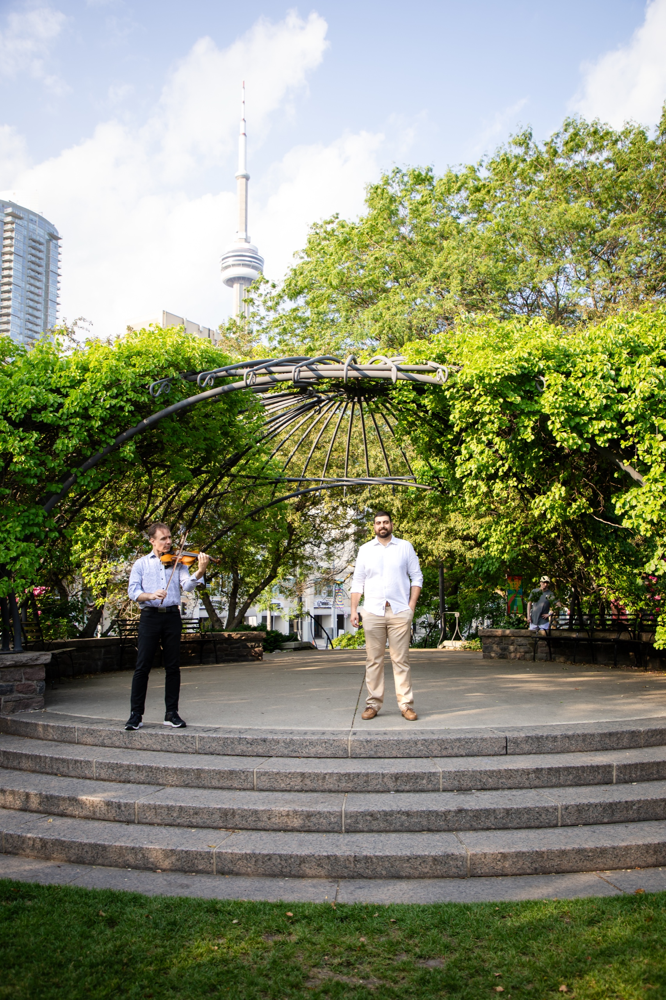

There is a small garden on the downtown Harbourfront where you can stand under an iron pavilion covered in vines, with a weeping willow on one side and the lake on the other, and look back to see the CN Tower rising directly over the treeline.

That is the Toronto Music Garden, and it is one of our favourite places in the city to photograph a proposal.

Most Toronto proposal spots make you choose. You can have the skyline, which usually means concrete and traffic and a lot of strangers in the background. Or you can have greenery, which usually means driving out of the city. The Music Garden gives you both inside a space you can walk end to end in about ten minutes.

Margarita and Mike proposed here on a June evening, with a violinist hidden under the pavilion and her best friend walking her in without telling her a thing. This guide is everything we learned shooting it.

## The Toronto Music Garden at a glance

**Location:** 479 Queens Quay West, on the Harbourfront between Spadina Avenue and Bathurst Street.

**What it is:** A public City of Toronto park designed by cellist Yo-Yo Ma with landscape designer Julie Moir Messervy, laid out as a physical interpretation of Bach's First Suite for Unaccompanied Cello.

**Setting:** Six connected sections, one for each dance movement of the suite. Winding paths, a birch grove, a wildflower meadow, a conifer circle, a formal flower area with an ornamental steel pavilion, and a curved grass amphitheatre with broad granite steps and a stone stage under a willow.

**The skyline:** The CN Tower is visible from the amphitheatre and the pavilion, framed by trees and the ironwork.

**Getting there:** The 509 Harbourfront and 510 Spadina streetcars stop on Queens Quay West within a short walk. Paid lots and garages sit along Queens Quay a couple of minutes away.

**Permits:** It is a public park and a proposal with one photographer is normal use. The City does require permits for formal photography and for wedding ceremonies in its parks, so anything bigger than a couple and a camera is worth a call to 311 first.

**Best light:** Golden hour, the ninety minutes before sunset.

**Best seasons:** Spring through fall. The garden is planted to peak in the warm months.

## Why the skyline works here

Most skyline shots in Toronto are taken from across the water, so the city looks far away and small. Here you are inside the downtown core, so the tower reads as tall and close, and there is a wall of green in front of it.

The trick is height and angle. From the lawn at the bottom of the amphitheatre, looking up at the stone stage, the tower lines up directly behind whoever is standing there. Drop the camera low and the ironwork of the pavilion arcs over their heads while the tower fills the gap in the trees.

That single sightline is the reason we keep bringing couples here. You get the postcard and the private garden in one frame, and you never have to explain to anyone where the photo was taken.

## Where to actually stand: the five best corners

### 1. The amphitheatre and the iron pavilion

This is the proposal spot. Curved granite steps drop down to a lawn, with a stone stage at the top and an ornamental steel pavilion wrapped in climbing vines right behind it. It is theatrical without being fussy, and the CN Tower sits directly over it.

It also solves a practical problem. Your partner walks in along a path, so they arrive facing the stage. You are already standing there. There is a natural moment where they stop and understand what is happening, and that reaction is usually the best photograph of the entire day.

### 2. The stone steps themselves

Once the proposal is over and everyone stops shaking, the granite steps become the easiest place in the garden to sit and just be with each other. Wide, clean, warm in colour, and they give a photographer height to work with.

### 3. The weeping willow by the marina

Walk toward the water and there is a huge willow with branches hanging almost to the grass, with sailboats moored right behind it. Shoot into it and the couple is surrounded by soft green on every side.

### 4. The lamp lined promenade

Just east of the garden, a wide walkway runs between rows of trees and round globe lamp posts. In the last half hour of light those lamps come on while the sun is still going, and you get warm light from two directions at once. This is where we shoot walking frames and dips.

### 5. The wildflower meadow

A swirling path cuts through tall grasses and wildflowers, with the water and the city peeking through. Good for movement: spins, walking shots, the kind of frame where the dress does the work.

## How a hidden proposal shoot actually works

The logistics matter more than the location. Here is the version we run.

**We pick the exact spot in advance.** Not "the Music Garden", but which step, facing which direction, at what time. That is a five minute conversation and it removes almost all the risk.

**I get there early and blend in.** Long lens, casual clothes, sitting on a bench or standing near the treeline. On a Harbourfront evening there are dozens of people with cameras and phones. Nobody looks twice.

**You bring your partner in on a normal walk.** Margarita thought she was meeting her best friend for photos. That is a good cover story because it explains the outfit.

**The moment happens and I do not move.** From a distance I photograph the approach, the realisation, the knee, the ring, and the first hug without interrupting any of it. That whole sequence usually takes under two minutes.

**Then we do the portraits.** Once the shock wears off, I walk over, introduce myself properly, and we spend the next hour on a proper couples session. This is the part people underestimate. You will never be more relaxed and more happy in front of a camera than in the hour right after a yes.

You can see the full set from that evening in the [Margarita and Mike gallery](/portfolio/margarita-mike/).

## Small things that make a proposal here land

**Bring a musician.** Mike hired a violinist to play under the pavilion. It cost a fraction of what people assume, it filled a silence that would otherwise have been very loud, and it gave the whole thing a shape: music starts, she walks in, he turns around.

**Bring one or two people, not twenty.** Her best friend was there, and having one person who could hug her ten seconds after the yes was worth more than a crowd. A large group turns a private moment into a performance.

**Plan for the wind.** It comes off Lake Ontario constantly. That is a gift for photographs and a nuisance for hair. Bring a small clip, and then let it be messy anyway.

**Have somewhere to go after.** The garden sits a short walk from Queens Quay restaurants and the ferry terminal. Book something. You will want to sit down and call everyone.

## When to go

**Early weekday morning** is the quietest the garden ever gets. If you want almost nobody in the background, this is the window. Light is soft and clean.

**Weekend late afternoon and evening** is busiest, especially in summer when free concerts run in the amphitheatre. If your date lands here, we shoot the open waterfront first and move into the garden as people leave.

**Golden hour** is the one to build around. The last ninety minutes before sunset gives you warm light on the stone, the lamps coming on along the promenade, and a thinning crowd.

**Season by season:** spring for fresh green and blossom, summer for full lush planting and long evenings, early fall for warm colour and comfortable light. In deep winter the garden goes bare and most of what makes it special disappears, so we usually send couples elsewhere for a January date.

## Who the Music Garden is right for

**You want the skyline without the concrete.** If your partner has ever said they want "somewhere green but still Toronto", this is the answer.

**You do not want to walk far.** Everything is within a few hundred steps, which matters more than people expect when someone is in heels and a long dress.

**You want it to feel private.** The garden is small and layered, so even on a busy evening there are corners where the city disappears for a frame or two.

**You are combining a proposal with an engagement session.** The range here is wide enough that one location covers both without repeating backdrops.

We have shot this garden several times now, in different seasons and for very different couples. [Josie and Nelson](/portfolio/josie-nelson/) did a pre-wedding session here on a spring evening. [Abdullah and Nadia](/portfolio/abdullah-nadia/) held an early morning civil ceremony in the same garden. [Harsh and Bhayva](/portfolio/harsh-bhayva/) finished a two location day here after starting at Blue Mountain.

If you are still choosing between spots, our guide to the [best Toronto pre-wedding locations](/blog/best-toronto-pre-wedding-locations/) lays out the alternatives, and [what to wear for a pre-wedding shoot](/blog/what-to-wear-pre-wedding-shoot/) covers the outfit question.

## Frequently asked questions

**Do you need a permit to propose at the Toronto Music Garden?**

For a proposal with one photographer and a camera, most couples never run into a permit issue in this public park. The City does require permits for formal photography and for wedding ceremonies in its parks, so if you are bringing a group, an arch, chairs, or a lighting setup, call 311 first.

**Where exactly is it?**

479 Queens Quay West, on the Harbourfront between Spadina and Bathurst. The 509 and 510 streetcars stop close by, and there are paid lots along Queens Quay a couple of minutes' walk away.

**Can you see the CN Tower from inside the garden?**

Yes. From the amphitheatre and the pavilion it sits right above the treeline, which is the main reason we shoot here.

**What time should we book?**

The ninety minutes before sunset for the best light, or early on a weekday morning for the emptiest garden.

**How does a surprise proposal shoot work?**

I arrive early, set up at a distance with a long lens, and photograph the whole moment without your partner knowing. Afterward we do a full couples session while you are both still buzzing.

## Photograph your proposal at the Toronto Music Garden

If you are planning to propose at the Music Garden and you want someone who already knows where to hide, which step to stand on, and where the CN Tower lines up, we would love to hear the plan.

[**View pre-wedding and engagement packages →**](/services/pre-wedding/)

Or [send a note about the Music Garden](/contact?venue=music-garden) and tell us the date you are thinking about. We will help you pick the exact spot.

Quick-reference version: the [Toronto Music Garden location guide](/location-guide/music-garden/) has the access, parking, and walking notes on one page.
