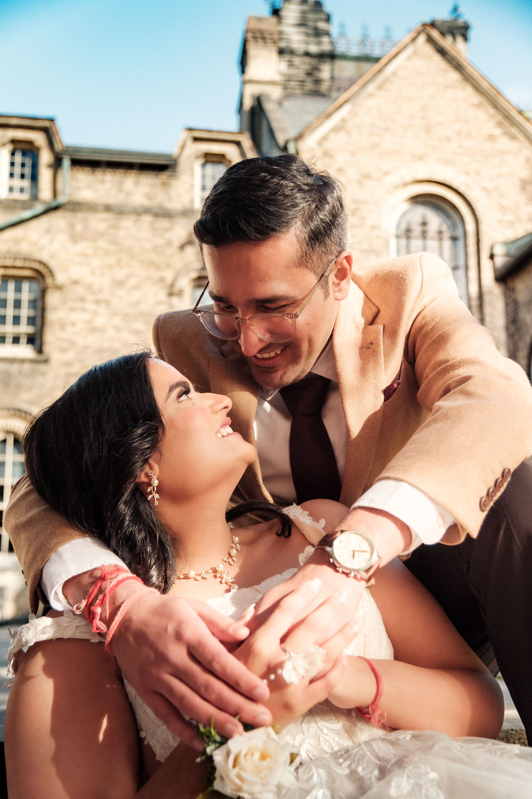
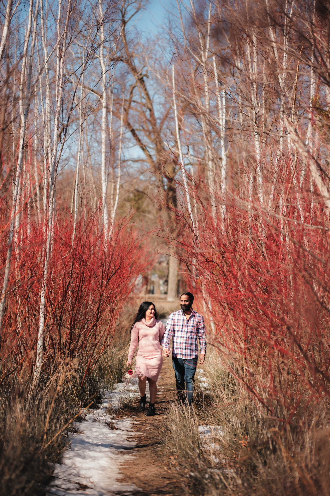

Priyanka and Saurav met at the University of Toronto, so when it came time for their pre-wedding session, the choice made itself. We went back, not to recreate anything, but to let the campus hold them the way it always has. We started at Knox College, where the Gothic stone arches and iron railings gave us a timeless, almost European quality of light.

The St. George campus is one of the most underrated locations for pre-wedding photography in the city. Century-old stone, ivy that turns fiery in October, Gothic cloisters that look like Oxford dropped into downtown Toronto, and all of it a short walk from the subway. If you met at U of T, studied there, or just love the architecture, it makes a beautiful backdrop.

If you are planning engagement photos at the University of Toronto, this is what you should know. The best spots, the light, the seasons, and the good news on permits for a pre-wedding session.

## University of Toronto at a glance

**Location:** St. George campus, downtown Toronto, centred on King's College Circle. A short walk from Queen's Park and St. George subway stations.

**Character:** Collegiate Gothic and Romanesque stone, ivy-covered walls, enclosed courtyards, and open green quads, all within a walkable campus.

**Permit:** Not needed for engagement, couple, or family photos. A permit is only required for wedding-day photography, the formal wedding shoot, booked through Campus Events.

**Best spots:** Knox College, University College, King's College Circle, Hart House, Trinity College.

**Best light:** Late afternoon for warm directional light on the eastern facades. Early morning for soft, quiet frames.

**Best seasons:** October for autumn colour. Spring for warm light through the arches. Strong year-round.

**Walking level:** Low. Flat campus paths, with a few steps into courtyards.

## Good news on permits

Here is something couples often worry about and do not need to. For an engagement or pre-wedding session, you do not need a permit at the University of Toronto. Regular couple photos, family photos, and engagement shoots on the St. George campus are treated as ordinary visitor use. We shoot them freely, walking the campus the same as anyone else.

The permit requirement applies to wedding-day photography, the formal wedding shoot itself, which the university books per location through Campus Events. So if you are planning your engagement or pre-wedding portraits here, you are clear to go. The only thing worth a glance is the day's schedule, since the occasional courtyard closes for a university event, so we plan the route around whatever is open.

## The best photo spots at the University of Toronto

After several sessions on campus, these are the spots worth your time.

### 1. Knox College

The standout. Knox College is a classic Gothic cloister, covered arcades and stone columns wrapped around a central lawn, with pointed arches and ivy that turns brilliant orange in October. It feels like Oxford or Cambridge dropped into downtown Toronto. The covered arcade gives you soft, even light even on a harsh day, and the symmetry does the composition for you. This is the spot couples come to U of T for.

### 2. University College

University College is the romantic choice. High Victorian and Romanesque stone, towers, deep archways, and an intimate quad that feels very old-university. The Gothic Revival archways frame a couple in dramatic stone and shadow, especially on a spring afternoon when the light carves through them.

### 3. King's College Circle

The grand vista. King's College Circle is the big circular lawn at the heart of campus, with the neoclassical dome of Convocation Hall as a backdrop and the CN Tower rising beyond the buildings. This is where you get the wide, walking, full-of-air frames that balance all the tight architectural shots.

### 4. Hart House

Collegiate Gothic stone, cloister-like passages, leaded windows, and heavy wood doors. Hart House is the versatile spot, good for stone arches one minute and a quiet green corner the next. A strong pairing with Knox College since they share the same old-world mood.

### 5. Trinity College

The quiet option. Elegant quadrangles, chapel-like architecture, and enclosed collegiate lawns. Less photographed than the others, which can be exactly the point if you want stillness and clean stone without anyone wandering through your frame.

## When to shoot at the University of Toronto

**October:** The best month. Ivy on Knox College turns fiery orange, and the walkways fill with gold and amber. Autumn and old stone are made for each other.

**Spring:** A close second. Warm directional light wraps through the Gothic arches, the campus greens up, and the crowds are thinner than summer.

**Late afternoon:** The eastern facades catch warm light around 3 PM in early October. The low sun carves shadow into the arches and makes the stone glow.

**Morning:** Soft, even light and the quietest version of campus. Good if you want the courtyards to yourselves.

**A note on term time:** Campus is busiest during the school year on weekdays. Weekends and the summer term are calmer, and the photography program books on specific days anyway, so we plan around it.

## What couples should plan for

**No permit for your engagement session.** Couple, family, and pre-wedding photos do not require a permit, so there is nothing to book. Wedding-day photography is the one exception that needs a Campus Events permit, and we coordinate that if it applies to you.

**Party size.** Keep it small and mobile, a couple plus a few family members. Large groups draw more attention on a busy campus and are harder to move between spots.

**Access can change.** Courtyards can close for university events or class use, and a few spots have standing restrictions. We build the route around what is actually open on your date.

**Getting there.** The campus sits between Queen's Park, St. George, and Museum stations, so transit is easy. Driving means paid lots or metered street parking nearby.

**Pair it with a second location.** A campus session and a downtown or lakefront session combine beautifully. See our guide to the [best Toronto pre-wedding locations](/blog/best-toronto-pre-wedding-locations) for spots that pair well, like the waterfront or [RC Harris](/blog/rc-harris-engagement-photos-toronto).

## Who the University of Toronto is right for

**You have a connection to the school.** If you met, studied, or fell in love here, the campus carries a meaning no rented backdrop can. Those are some of our favourite sessions to shoot.

**You love old-world architecture.** Gothic cloisters, Romanesque stone, ivy and arches. If you pinned European university courtyards, U of T gives you that look without the flight.

**You want range in a small footprint.** Tight stone arches, grand open lawns, and quiet quads all within a short walk, no rushing across the city.

## Frequently asked questions

**Do you need a permit for engagement photos at U of T?**

Yes, for a professional shoot. Campus Events requires a wedding and lifestyle photography permit, around $500 per location, booked in advance. We handle the coordination.

**What are the best spots?**

Knox College, University College, King's College Circle, Hart House, and Trinity College. Knox is the standout.

**Can you shoot in the Knox College courtyard?**

Yes, but access is controlled and must be booked under the photography program for your date. Confirm availability when you book.

**What's the best time of year?**

October for autumn colour, spring for warm light through the arches. Strong year-round.

## Photograph your session at the University of Toronto

The U of T campus is one of Toronto's most timeless backdrops, and we know the route, the light, and how to handle the permit so the day runs smoothly. If you are planning an engagement or pre-wedding session here, we would love to talk.

[**View pre-wedding and wedding packages →**](/services)

Or [send a note about a U of T session](/contact?venue=university-of-toronto) and tell us what you are planning. We always start with a conversation about the shoot, the looks, and the frames you are hoping for.
