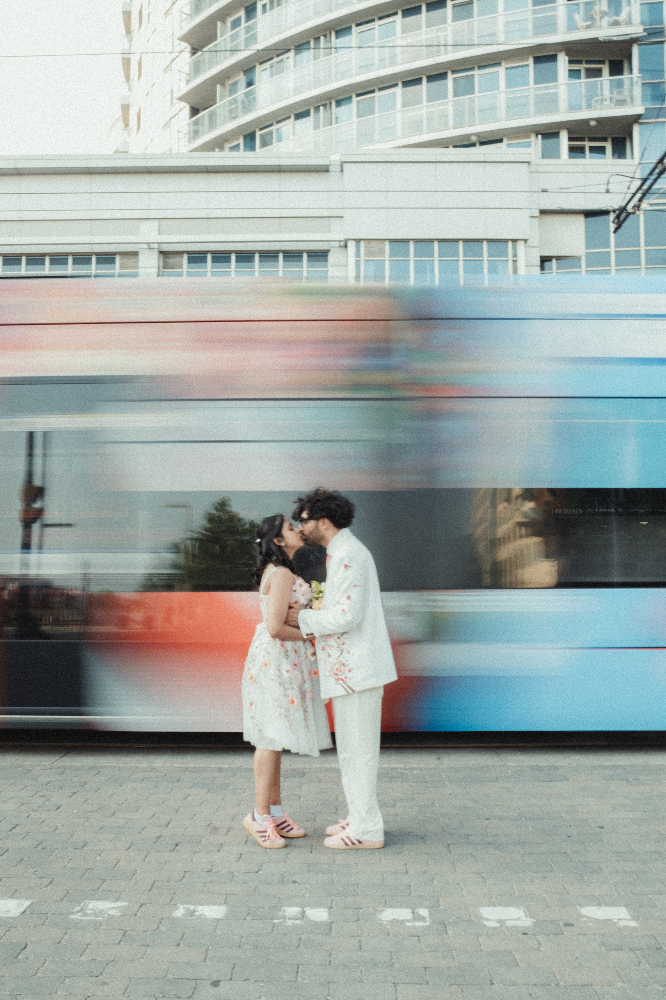
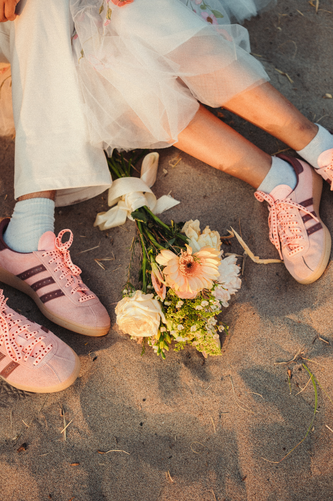
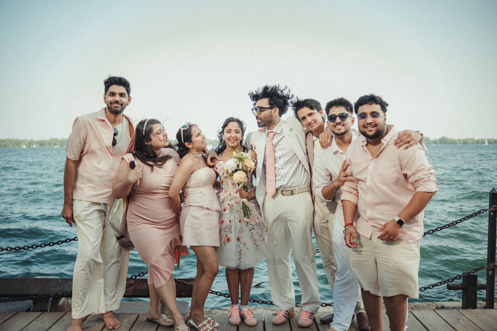
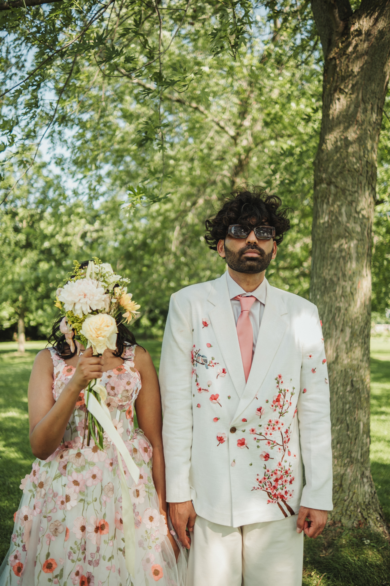

Harsh and Payal's wedding film is the most stylised thing we have made, and it started with a decision the couple made months before we pressed record: everybody would be dressed in coral and cream.

That is the part people miss about the Wes Anderson look. It is not a grade you apply afterwards. It is a palette you commit to in advance, and then protect.

  <iframe src="https://www.youtube-nocookie.com/embed/E-QYO3YNNuo" title="Toronto Wedding Film in 4K, Wes Anderson Style, SIRUI 40mm Anamorphic" style="position:absolute;top:0;left:0;width:100%;height:100%;border:0;" allow="accelerometer; autoplay; clipboard-write; encrypted-media; gyroscope; picture-in-picture" allowfullscreen loading="lazy"></iframe>

## Why anamorphic for a wedding

Most wedding films are shot on ordinary spherical lenses and cropped to a widescreen ratio in the edit. You get the shape, but you throw away pixels to get it, and the image itself still looks like everything else.

An anamorphic lens squeezes a wider field of view onto the sensor optically, and you stretch it back out in post. You keep the full height of the sensor and you gain the ratio. You also gain the things people actually associate with cinema without being able to name them: oval bokeh, horizontal streak flares, and a slightly stretched sense of depth that makes a normal park look like a set.

For a wedding, that last part is the whole point. Nobody remembers the resolution. They remember that it looked like a film.

## The lens: SIRUI 40mm T1.8 1.33x autofocus anamorphic

The specifics, since this is the part people search for:

- **1.33x squeeze.** Shoot 16:9, desqueeze, land at roughly **2.35:1**.
- **T1.8 maximum aperture**, which is genuinely fast for an anamorphic.
- **Super 35 and APS-C coverage.** Not full frame. Check your camera before you buy.
- **Mounts:** Sony E, Nikon Z, Fuji X, Leica L, Micro Four Thirds.
- **Autofocus** via an STM motor, with an AF and MF switch, eye focus support, and an AFL button.
- Available in a **blue flare** version and a neutral, warmer streak version. Blue is the classic anamorphic signature.
- Around **699 to 799 US dollars**, released in **2025**.

The headline is the autofocus. Anamorphic lenses have almost always been manual focus, which is completely fine when you have a focus puller and a rehearsed blocking chart, and completely miserable when you are one person, the couple is walking at you, and the moment will not repeat. SIRUI putting an autofocus motor in a 1.33x anamorphic is what moves this from a specialty lens to something you can actually cover a wedding day with.

A 40mm on Super 35 is also a genuinely useful focal length for this work. Wide enough to hold two people and the room, long enough that faces are not distorted. On a shoot that moves from a downtown street to a ferry to a beach, being able to stay on one lens matters more than having the perfect lens for each scene.

The honest trade offs: it is not full frame, close focus is not its strength, and like every anamorphic it wants light and it wants you to keep horizontals level. Anamorphic punishes a tilted frame in a way spherical lenses do not.

## The Wes Anderson part

Anderson's style is a specific, repeatable grammar. These are the pieces that transfer to a wedding day.

### Centred symmetry

Put the subject dead on the vertical axis. Not thirds, not off centre. The middle. It reads as deliberate and slightly formal, which is exactly the register you want.

### Planimetric composition

Face the scene straight on so the frame flattens and the background reads like a painted backdrop rather than receding space. Anderson does this constantly. It is why his shots feel like panels in a book.

The streetcar frame from Harsh and Payal's day is the clearest example of both ideas at once. Camera square to the street, couple centred and still, and a streetcar dragging a band of colour across the entire background.

### Whip pans and snap zooms

Fast pans between two symmetrical setups, and abrupt zooms to punctuate a beat. Used as transitions rather than decoration. A little goes a very long way.

### God's eye inserts

Straight down, top down shots of objects laid out flat. Rings, shoes, the bouquet, the invitation. Anderson uses overheads to present things like diagrams, and they cut beautifully into a wedding film as chapter breaks.

### Tableau staging

Arrange people like figures in a composed picture rather than catching them naturally. This is the one that feels wrong the first time you ask for it and looks best in the edit. Line the group up, face them forward, let them be still.

### Deadpan

Anderson's characters do not mug for the camera. They look back at it, flatly, and the comedy comes from the stillness. Ask a couple to look down the lens and not smile and you will get something far more interesting than another laughing shot.

### Lateral tracking

Smooth sideways moves across a scene rather than handheld drift. A slider or a gimbal held disciplined and level. The move should feel mechanical, not human.

### Chapter cards and a controlled palette

Title cards between sections, in a bookish serif rather than a modern sans. And a colour palette that is curated rather than naturalistic: muted pastels, warm creams, a single accent that repeats.

Harsh and Payal did the hardest part of this for us. The coral and cream ran through her gown, his embroidered jacket, his tie, both pairs of pink sneakers, every one of their friends, and the cake. When the wardrobe is that disciplined, the grade barely has to do anything.

## What I would tell you before you try this

**Get the couple in on it early.** The palette is the film. If the wedding party turns up in six unrelated colours, no amount of grading saves it.

**Symmetry is unforgiving.** A frame that is nearly centred looks like a mistake. Commit fully or do not do it.

**Do not do all of it.** A film that is nothing but whip pans and centred tableaux is exhausting by minute two. The style works because it is punctuated with ordinary, warm, human footage. Harsh and Payal's film has plenty of loose handheld in it, and the composed frames land harder because of the contrast.

**Watch your horizon.** Anamorphic plus centred composition means every tilted frame is obvious.

**Shoot the ratio you will finish in.** Decide on the 2.35:1 desqueeze before the day, not in the edit, so you are composing for the frame you will actually deliver.

## See the rest

The full photo gallery from the day is here: [Harsh + Payal on the Toronto Islands](/portfolio/harsh-payal/). If you are thinking about the location itself, we wrote a full guide to the permits, the ferry and the best spots: [Toronto Islands wedding photos](/blog/toronto-islands-wedding-photos-guide/).

If you want a wedding film that looks like this, [get in touch](/contact/#inquiry). It works best when we talk months ahead, because the parts that make it work are decided long before the camera comes out.
